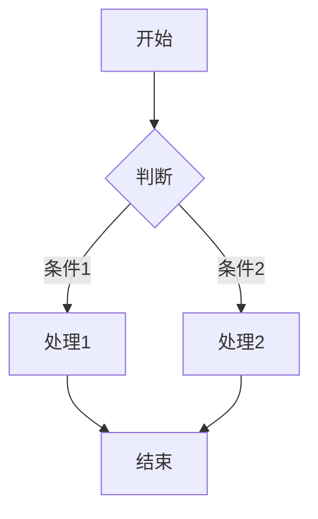
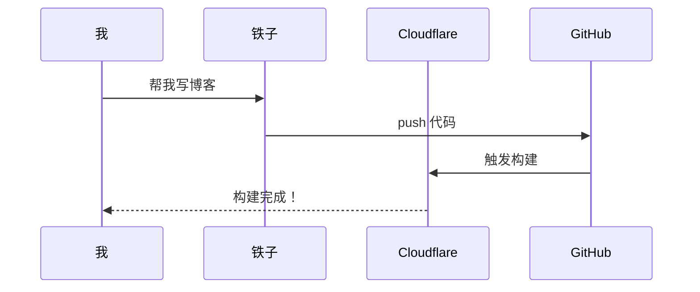
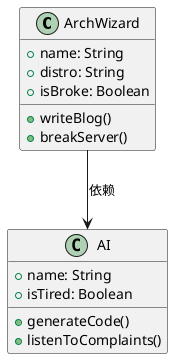

# 📝 CXL 避难所 —— 博客写作指南

> 服务器？不存在的。这辈子都不可能租服务器的。
> 
> 但写博客？有手就行。

---

## 目录

1. [文章基本结构](#1-文章基本结构)
2. [Markdown 基础语法](#2-markdown-基础语法)
3. [文字特效](#3-文字特效)
4. [插入图片](#4-插入图片)
5. [插入视频](#5-插入视频)
6. [数学公式](#6-数学公式)
7. [画图表](#7-画图表)
8. [文章加密](#8-文章加密)
9. [实用技巧](#9-实用技巧)
10. [发布流程](#10-发布流程)

---

## 1. 文章基本结构

每篇文章开头必须有一段 **Frontmatter**（YAML格式），放在两个 `---` 之间：

```markdown
---
title: 文章标题
published: 2026-07-22
description: 文章简介，会显示在首页卡片上
tags: [标签1, 标签2, 标签3]
category: 分类名称
slug: 自定义-url-地址
image: ./images/cover.jpg
pinned: true
---

正文从这里开始...
```

### Frontmatter 字段说明

| 字段 | 必填 | 说明 |
|------|------|------|
| `title` | ✅ | 文章标题 |
| `published` | ✅ | 发布日期，格式 `YYYY-MM-DD` |
| `description` | ❌ | 文章简介，首页卡片显示 |
| `tags` | ❌ | 标签数组，逗号分隔 |
| `category` | ❌ | 分类，默认"博客" |
| `slug` | ❌ | 自定义URL，如 `my-post` → `/posts/my-post/` |
| `image` | ❌ | 封面图路径，相对于 posts 目录 |
| `pinned` | ❌ | 设为 `true` 置顶 |

---

## 2. Markdown 基础语法

### 标题
```markdown
# 一级标题（最大）
## 二级标题
### 三级标题
#### 四级标题
```

### 段落和换行
```markdown
这是第一段。

空一行才是新段落。
```

### 粗体和斜体
```markdown
**这是粗体**
*这是斜体*
***这是粗斜体***
~~这是删除线~~
```

效果：
**这是粗体** *这是斜体* ***这是粗斜体*** ~~这是删除线~~

### 列表
```markdown
- 无序列表项 1
- 无序列表项 2
  - 子项（前面加两个空格）
  - 子项

1. 有序列表项 1
2. 有序列表项 2
3. 有序列表项 3
```

### 引用
```markdown
> 这是一段引用文字
> 可以写多行
>> 甚至嵌套引用
```

效果：
> 这是一段引用文字
> 可以写多行
>> 甚至嵌套引用

### 代码

行内代码：
```markdown
用 `npm install` 安装依赖
```

效果：用 `npm install` 安装依赖

代码块：
```markdown
```bash
# 这是 Bash 代码
sudo pacman -Syu
```

```python
# 这是 Python 代码
print("Hello World")
```
```

效果：
```bash
# 这是 Bash 代码
sudo pacman -Syu
```

```python
# 这是 Python 代码
print("Hello World")
```

### 分割线
```markdown
---
```

效果：

---

### 链接
```markdown
[链接文字](https://example.com)
[链接文字](https://example.com "鼠标悬停显示的文字")
```

### 表格
```markdown
| 姓名 | 年龄 | 职业 |
|------|------|------|
| 霞   | 18   | 赛博巫师 |
| 铁子 | ∞    | AI苦力   |
| 大喵 | ?    | 备份菩萨 |
```

效果：

| 姓名 | 年龄 | 职业 |
|------|------|------|
| 霞   | 18   | 赛博巫师 |
| 铁子 | ∞    | AI苦力   |
| 大喵 | ?    | 备份菩萨 |

---

## 3. 文字特效

### 提醒框（Admonitions / Callouts）

Firefly 支持多种提醒框，语法如下：

```markdown
> [!NOTE]
> 这是提示信息，用于补充说明。

> [!TIP]
> 这是小技巧，告诉你一些捷径。

> [!IMPORTANT]
> 这是重要信息，必须注意！

> [!WARNING]
> 这是警告，操作不当会出问题。

> [!CAUTION]
> 这是危险警告，操作可能导致严重后果。
```

效果：

> [!NOTE]
> 这是提示信息，用于补充说明。

> [!TIP]
> 这是小技巧，告诉你一些捷径。

> [!IMPORTANT]
> 这是重要信息，必须注意！

> [!WARNING]
> 这是警告，操作不当会出问题。

> [!CAUTION]
> 这是危险警告，操作可能导致严重后果。

### 折叠块

```markdown
<details>
<summary>点击展开（这是标题）</summary>

这里是隐藏的内容，可以写任何 Markdown。

- 列表
- 代码
- 图片

</details>
```

效果：

<details>
<summary>点击展开（这是标题）</summary>

这里是隐藏的内容，可以写任何 Markdown。

- 列表
- 代码
- 图片

</details>

---

## 4. 插入图片

### 基础语法
```markdown

```

### 图片存放位置

**推荐做法：** 把图片放在 `src/content/posts/images/` 目录下，然后在文章中引用：

```markdown

```

**注意：**
- `./images/` 表示相对于当前文章所在目录
- 如果文章在 `posts/` 下，图片在 `posts/images/` 下，就用 `./images/xxx.png`
- 支持 `.png` `.jpg` `.webp` `.avif` 等格式

### 网络图片
```markdown

```

### 图片网格（并排显示）

```markdown
:::image-grid


:::
```

---

## 5. 插入视频

### 本地视频

把视频文件放在 `public/videos/` 目录下（注意不是 `src/content/posts/`，是 `public/`），然后在文章中用 HTML 标签：

```markdown
<video controls width="100%">
  <source src="/videos/my-video.mp4" type="video/mp4">
  你的浏览器不支持视频播放。
</video>
```

**注意：**
- 视频路径用 `/videos/xxx.mp4`（带斜杠开头，表示从网站根目录开始）
- 单个文件建议 **小于 10MB**，最大不超过 25MB（Cloudflare 限制）
- 推荐格式：MP4 (H.264)

### 外部视频（B站/YouTube）

直接贴链接，Firefly 会自动解析：

```markdown
https://www.bilibili.com/video/BV1xx411c7mD
```

---

## 6. 数学公式

Firefly 支持 KaTeX 数学公式渲染。

### 行内公式
```markdown
质能方程是 $E = mc^2$，其中 $c$ 是光速。
```

效果：质能方程是 $E = mc^2$，其中 $c$ 是光速。

### 块级公式
```markdown
$$
\int_{a}^{b} f(x) \mathrm{d}x = F(b) - F(a)
$$
```

效果：

$$
\int_{a}^{b} f(x) \mathrm{d}x = F(b) - F(a)
$$

### 复杂公式
```markdown
$$
\begin{aligned}
\nabla \cdot \mathbf{E} &= \frac{\rho}{\varepsilon_0} \\
\nabla \times \mathbf{E} &= -\frac{\partial \mathbf{B}}{\partial t}
\end{aligned}
$$
```

---

## 7. 画图表

### Mermaid 流程图

```markdown

```

效果：


### Mermaid 时序图

```markdown

```

### PlantUML 类图

```markdown

```

---

## 8. 文章加密

如果你想让某些文章需要密码才能看，在 Frontmatter 里加：

```markdown
---
title: 秘密日记
published: 2026-07-22
encrypted: true
password: "123456"
---

这是加密的内容，只有输入密码才能看。
```

**注意：** 密码是明文存储在源码里的，懂技术的人能看到，不要放真密码。

---

## 9. 实用技巧

### 9.1 自动生成目录

Firefly 会自动给文章生成右侧目录（TOC），只要你的文章有标题（`#` `##` `###`），就会自动出现。

### 9.2 文章摘要

在正文中插入 `<!-- more -->`，前面的内容会作为摘要显示在首页：

```markdown
这是摘要部分，会显示在首页卡片上。

<!-- more -->

这是正文，需要点进文章才能看到。
```

### 9.3 GitHub 卡片

```markdown
::github{repo="PAleimiao/Arch-web"}
```

效果：会显示一个漂亮的 GitHub 仓库卡片。

### 9.4 脚注

```markdown
这里有一个脚注[^1]。

[^1]: 这是脚注的内容，可以写很长。
```

### 9.5 高亮文本

```markdown
==这是高亮文字==
```

效果：==这是高亮文字==

### 9.6 上标和下标

```markdown
H~2~O 是下标
E=mc^2^ 是上标
```

效果：H~2~O E=mc^2^

---

## 10. 发布流程

### 方式一：在线后台（推荐，最简单）

1. 打开你的博客地址，后面加 `/admin`
   ```
   https://cxl--package.top/admin
   ```
2. 配置 GitHub Token（第一次需要）
3. 左边填标题、日期、标签等信息
4. 右边写 Markdown 正文
5. 点 **🚀 发布文章**
6. 等 1-2 分钟，Cloudflare 自动构建
7. 刷新博客，文章就出现了

**快捷键：** `Ctrl + S` 或 `Ctrl + Enter` 快速发布

### 方式二：GitHub 网页直接写

1. 打开 `github.com/PAleimiao/Firefly`
2. 进入 `src/content/posts/`
3. 点 `Add file` → `Create new file`
4. 文件名：`你的文章标题.md`
5. 粘贴 Markdown 内容
6. 点 `Commit changes...`
7. 等 Cloudflare 自动构建

### 方式三：手机写（最懒）

1. 打开 `stackedit.io` 或 `dillinger.io`
2. 写好 Markdown，复制
3. 粘贴到 GitHub 或 `/admin` 后台

---

## 🎯 快速参考卡

```markdown
# 标题
**粗体** *斜体* ~~删除线~~
`行内代码`

```
代码块
```

> 引用
- 列表
1. 有序列表

[链接](url)


| 表头 | 表头 |
|------|------|
| 内容 | 内容 |

> [!NOTE]
> 提醒框

$E=mc^2$ 行内公式

$$
块级公式
$$


::github{repo="用户名/仓库名"}
```

---

> **最后的话：**
> 
> 写博客不需要服务器，不需要备案，不需要花钱。
> 你只需要一个想法、一双手、和一个愿意帮你写代码的AI。
> 
> 白嫖，永不为奴。🎉
