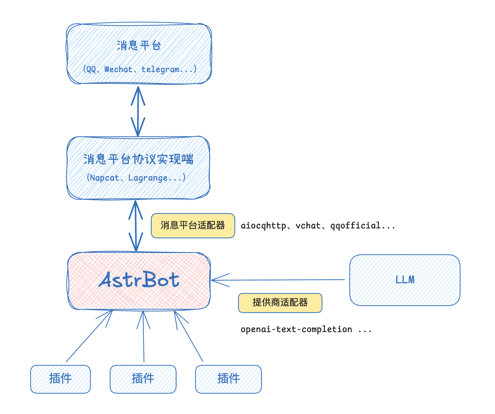
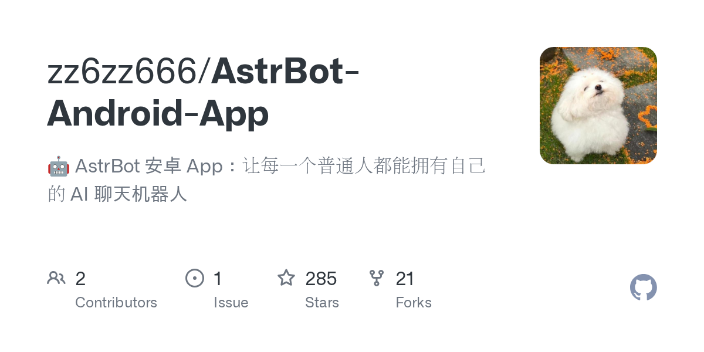
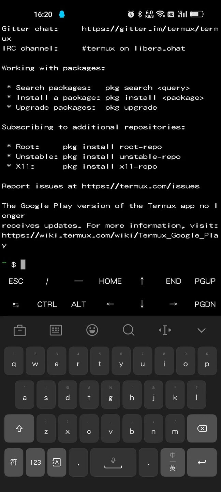

> 服务器过期了，电脑不在身边，但就是想搞个QQ机器人？
> 别慌，**安卓手机就能跑**，而且有两种方案可选。

<!-- more -->

---

## 一、先搞清楚：手机部署QQ机器人的原理

QQ机器人需要两个东西配合：

1. **NapCat** —— 负责连接QQ，让机器人能收发消息（相当于QQ的"替身"）
2. **AstrBot** —— 负责处理消息，接入AI大模型回复（相当于机器人的"大脑"）



在手机上，这两个组件都能跑，只是方式不同：

| 方案 | 难度 | 适合人群 | 稳定性 |
|------|------|----------|--------|
| **AstrBot 安卓 App** | 极低 | 纯小白 | 中等（看系统杀后台） |
| **Termux 手动部署** | 中等 | 爱折腾的 | 较高 |

---

## 二、准备工作

你需要：
1. 一部 **安卓手机**（运行内存建议 4G 以上，存储空间 2G 以上）
2. 一个 **QQ小号**（别用大号，万一被封了哭死）
3. 一个 **大模型 API Key**（OpenAI、DeepSeek、Gemini 都行，没有的话机器人就是复读机）
4. **带脑子**（最重要）

> ⚠️ **警告**：QQ机器人存在封号风险，建议使用小号，且不要用于违规用途。

---

## 三、方案A：AstrBot 安卓 App（一键安装，推荐小白）

这是最简单的方案，由社区大佬 zz6zz666 打包的 App，**把 NapCat + AstrBot 封装成了一个 APK**，安装即用。



### 3.1 下载安装

GitHub 仓库：`https://github.com/zz6zz666/AstrBot-Android-App`

- 有梯子的直接去 Release 页面下载最新 `.apk`
- 没梯子的去 123 云盘（仓库里有分享链接）

安装完成后，打开 App，**允许通知权限**（必须！否则后台会被杀）。

### 3.2 启动并登录QQ

1. 打开 App，等待初始化（第一次会自动下载组件，大概几分钟）
2. 初始化完成后，会弹出 **QQ登录二维码**
3. 用你手机上的 QQ 扫码登录（建议用另一个设备扫，或者截图后用QQ识别）
4. 登录成功后，自动跳转到 AstrBot 控制台

### 3.3 配置大模型

1. 进入 AstrBot 控制台（内置 WebView，不用额外开浏览器）
2. 左侧菜单 → **"提供商"**，添加你的大模型 API Key
3. 支持 OpenAI、DeepSeek、Gemini、Llama 等主流模型
4. 保存并启用

### 3.4 测试机器人

用另一个 QQ 号给机器人发消息，比如 `/help`，如果机器人回复了，说明搞定！

### 方案A优缺点

**优点：**
- 一键安装，零命令行
- 内置 NapCat，不用手动配置连接
- 有通知栏常驻，后台相对稳

**缺点：**
- 只能跑QQ，不支持微信/钉钉等其他平台
- 部分机型杀后台严重，需要手动保活
- 代码执行器功能不可用（依赖Docker环境）

---

## 四、方案B：Termux 手动部署（进阶，更稳）

如果你嫌 App 太简单、想折腾、或者 App 在你手机上跑不起来，可以用 **Termux** 手动部署。



### 4.1 安装 Termux

下载 **ZeroTermux**（推荐，比原版Termux更好用）：

GitHub 仓库：`https://github.com/hanxinhao000/ZeroTermux`

或者直接装原版 Termux（F-Droid 或 GitHub 下载，Google Play 版已停止维护）。

### 4.2 安装 Linux 容器

Termux 本身是个终端，但直接在里面跑 NapCat 会有各种问题。建议先装一个 **proot-distro**（Linux容器）：

```bash
# 更新软件源
pkg update && pkg upgrade -y

# 安装 proot-distro
pkg install proot-distro -y

# 安装 Debian 容器（推荐Debian 12）
proot-distro install debian

# 进入容器
proot-distro login debian
```

### 4.3 在容器里安装 AstrBot

```bash
# 更新apt源
apt update && apt upgrade -y

# 安装必要工具
apt install git curl python3 python3-pip screen -y

# 安装 uv（Python包管理器，比pip快）
curl -LsSf https://astral.sh/uv/install.sh | sh

# 克隆 AstrBot
cd ~
git clone https://github.com/AstrBotDevs/AstrBot.git
cd AstrBot

# 安装依赖
uv sync

# 启动 AstrBot
uv run main.py
```

看到 `WebUI 已启动，可访问 http://localhost:6185` 就说明 AstrBot 跑起来了。

**后台运行：**

```bash
# 用 screen 挂后台
screen -S astrbot
uv run main.py
# 然后按 Ctrl+A 再按 D 分离会话
```

### 4.4 安装 NapCat

在另一个终端会话里（或者新开一个 screen）：

```bash
# 安装 NapCat（官方一键脚本）
curl -o napcat.sh https://nclatest.znin.net/NapNeko/NapCat-Installer/main/script/install.sh
bash napcat.sh --docker n --cli y --force

# 启动 NapCat
napcat start 你的QQ号
```

启动后会显示二维码，扫码登录。

### 4.5 连接 AstrBot 和 NapCat

1. 浏览器访问 `http://localhost:6185`，登录 AstrBot 控制台
2. 左侧菜单 → **"机器人" → "创建机器人"**
3. 平台选择 **"QQ个人号"**，启用反向 WebSocket
4. 端口默认 `6199`，Token 随便设一个（两边要一致）

然后访问 NapCat 的 WebUI：`http://localhost:6099/webui`

1. 用初始 Token 登录（查看命令：`cat ~/Napcat/config/webui.json | grep token`）
2. 左侧 → **"网络配置" → "新建" → "WebSocket Client"**
3. URL 填 `ws://localhost:6199/ws`
4. Token 填刚才 AstrBot 那边设的
5. 消息格式选 `Array`，心跳间隔 `5000`
6. 保存并启用

### 4.6 测试

用另一个 QQ 给机器人发消息，如果两边日志都有显示，说明连接成功！

---

## 五、日常使用 & 保活技巧

### 启动流程（Termux版）

```bash
# 打开 ZeroTermux
# 进入容器
proot-distro login debian

# 启动 NapCat
napcat start 你的QQ号

# 新开一个会话启动 AstrBot
screen -S astrbot
cd ~/AstrBot && uv run main.py
```

### 保活设置（重要！）

Termux/App 在安卓上很容易被系统杀后台，需要做以下设置：

1. **电池优化** → 把 Termux/App 设为 **"不优化"** 或 **"无限制"**
2. **自启动权限** → 开启允许自启动
3. **后台锁定** → 在多任务界面把 Termux 锁上（下滑或长按加锁）
4. **开发者选项** → 关闭 **"后台进程限制"**

不同手机品牌路径不同，自己搜一下「XX手机 应用保活教程」。

---

## 六、常见问题

**Q：AstrBot App 初始化失败/二维码不弹出？**
> 关闭App重新打开，基本能自动修复。如果还是不行，检查网络是否能访问GitHub。

**Q：Termux里命令报错？**
> 大概率是网络问题，GitHub/raw链接下载失败。开梯子，或者换国内镜像源。

**Q：QQ扫码登录失败？**
> 用前置摄像头试试，或者截图二维码后用文件管理器打开识别。实在不行重启NapCat重新获取二维码。

**Q：机器人回复很慢？**
> 看你接的大模型API。免费Key通常慢，付费Key快。本地部署Ollama的话，看手机GPU性能。

**Q：被封号了怎么办？**
> 用小号就是为了防这个。封号一般是因为发送频率太高或内容违规，调低回复频率，别在群里刷屏。

**Q：能接入本地AI模型吗？**
> 可以，装 Ollama + 拉一个轻量级模型（比如 qwen2:1.8b），在 AstrBot 提供商里配置本地地址。

---

## 七、两种方案怎么选？

| 维度 | AstrBot App | Termux手动 |
|------|-------------|------------|
| 安装难度 | 下载APK就行 | 需要敲命令 |
| 配置复杂度 | 几乎为零 | 中等 |
| 后台稳定性 | 看系统心情 | 相对更稳 |
| 功能完整度 | 缺少代码执行器 | 完整 |
| 可定制性 | 低 | 高（想装啥装啥）|
| 适合人群 | 只想快速用 | 爱折腾、想长期跑 |

**一句话建议：**
- 想**5分钟搞定** → 用 App
- 想**长期稳定跑**、或者 App 在你手机上闪退 → 用 Termux

---

## 结语

以前搞QQ机器人，得买服务器、装Linux、配环境、调防火墙，一套下来没个半天搞不定。

现在好了，**安卓手机就能跑**，蹲厕所的功夫都能把机器人搭起来。

AstrBot + NapCat 这套组合，是目前（2026年）最简单、最稳定的QQ机器人方案。App版让小白也能玩，Termux版让极客能折腾，各取所需。

> 最后提醒：机器人好玩，但别违规，别用大号，被封了别来找我哭。

如果你看完这篇还是不会，**建议直接复制粘贴命令**，报错截图发我，我帮你瞅瞅。

*P.S. 本文基于 AstrBot v3.x + NapCat v2.x，如果后续版本界面改了，大体流程应该差不多。*
