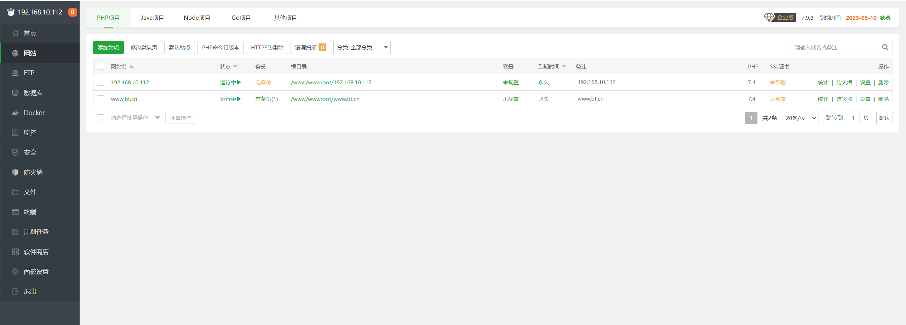
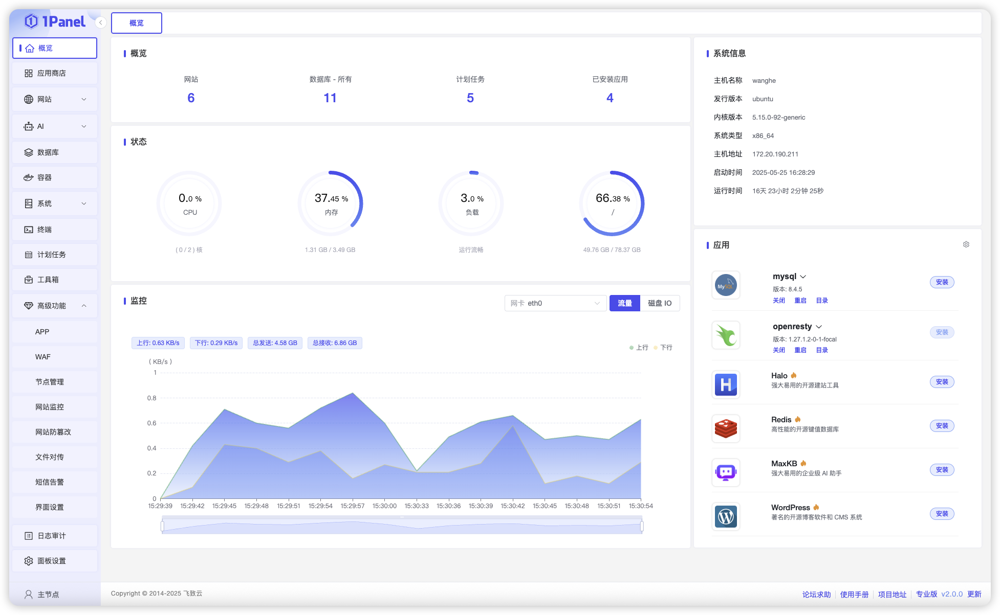

> 服务器买了，SSH连上了，然后呢？
> 别在终端里瞎敲命令了，装个面板，点点鼠标就能建站。

<!-- more -->

---

## 一、先搞清楚：有服务器 vs 无服务器的区别

| 对比项 | 无服务器（GitHub+Cloudflare） | 有服务器（宝塔/1Panel） |
|--------|------------------------------|------------------------|
| 成本 | 免费 | 服务器月租（几十到几百） |
| 技术门槛 | 低，会点Git就行 | 中等，要懂基础Linux |
| 能跑什么 | 静态网站 only | 动态网站、数据库、后端 |
| 自由度 | 低，受平台限制 | 高，想装啥装啥 |
| 适合人群 | 博客、展示页 | 论坛、商城、需要后端的 |

**简单说：需要数据库、用户登录、后台管理？买服务器。只是展示？看上一篇无服务器版。**

---

## 二、准备工作

你需要：
1. 一台 **Linux 服务器**（推荐 Ubuntu 22.04 或 CentOS 7/8）
2. 一个 **域名**（已解析到服务器IP）
3. 一个 **SSH 客户端**（电脑用 PuTTY/Termius，手机用 Termux/JuiceSSH）
4. 耐心（装面板大概5分钟，建站10分钟）

> 服务器推荐：阿里云、腾讯云、华为云，新用户首年几十块。  
> 或者去闲鱼淘二手服务器，更便宜（但稳定性看运气）。

---

## 三、方案A：宝塔面板（经典老牌，小白首选）

### 3.1 安装宝塔

SSH 连接你的服务器，执行下面命令（根据系统选择）：

**Ubuntu/Debian：**
```bash
wget -O install.sh https://download.bt.cn/install/install-ubuntu_6.0.sh && sudo bash install.sh ed8484bec
```

**CentOS：**
```bash
yum install -y wget && wget -O install.sh https://download.bt.cn/install/install_6.0.sh && sh install.sh ed8484bec
```

等个 2-3 分钟，装完后终端会显示：
- 面板地址：`http://你的服务器IP:8888/随机字符串`
- 用户名：`admin`
- 密码：`随机生成的密码`

**把这仨记下来，丢了只能重装。**

### 3.2 登录面板

浏览器打开那个地址，输入用户名密码登录。

第一次登录会弹窗让你**绑定宝塔账号**（免费注册一个），绑定完就能用了。

### 3.3 安装环境

宝塔会推荐你安装 **LNMP** 或 **LAMP**：

- **LNMP**：Linux + Nginx + MySQL + PHP（推荐，性能更好）
- **LAMP**：Linux + Apache + MySQL + PHP（兼容性更好）

版本选择：
- Nginx：1.24 或最新稳定版
- MySQL：5.7（稳定）或 8.0（新特性多）
- PHP：7.4（老项目）或 8.1（新项目）

点 **"一键安装"**，等 10-20 分钟，可以去泡杯茶。

### 3.4 添加网站

环境装好后，左侧菜单点 **"网站" → "添加站点"**。



填写：
- **域名**：输入你的域名，比如 `www.yourname.top`
- **根目录**：默认就行（`/www/wwwroot/域名`）
- **数据库**：如果需要，勾选创建 MySQL 数据库，设置用户名密码
- **PHP版本**：选你刚才装的那个

点 **"提交"**，网站就创建好了。

### 3.5 上传代码

进入网站根目录（文件管理器里点进去），把代码传上去：

**方式A：宝塔自带文件管理器**

直接拖拽上传，或者在线编辑。

**方式B：FTP**

宝塔会自动创建 FTP 账号，用 FileZilla 连接上传。

**方式C：Git 拉取**

在终端执行：
```bash
cd /www/wwwroot/你的域名
git clone https://github.com/你的用户名/仓库名.git .
```

### 3.6 配置数据库（如果需要）

如果你的网站需要数据库（比如 WordPress、Typecho）：

1. 左侧菜单 **"数据库"**，找到刚才创建的库
2. 点 **"管理"** 进入 phpMyAdmin
3. 导入你的 SQL 文件，或者手动创建表

### 3.7 配置伪静态 / 重写规则

如果你的网站用了框架（比如 Laravel、ThinkPHP、Vue Router History 模式），需要配置伪静态：

1. 网站设置里点 **"伪静态"**
2. 选择对应的框架预设（比如 `thinkphp`、`laravel5`）
3. 保存

### 3.8 SSL 证书（HTTPS）

宝塔自带 **Let's Encrypt** 免费证书：

1. 网站设置里点 **"SSL"**
2. 选择 **"Let's Encrypt"**
3. 勾选域名，点 **"申请"**
4. 等 1-2 分钟，证书自动配置好
5. 开启 **"强制 HTTPS"**

> 注意：申请 SSL 前，确保域名已经解析到服务器 IP，否则验证失败。

---

## 四、方案B：1Panel（新兴面板，更现代）

如果你觉得宝塔太臃肿、广告多，可以试试 **1Panel**，开源免费，界面更清爽。

### 4.1 安装 1Panel

SSH 连接服务器，执行：

```bash
curl -sSL https://resource.fit2cloud.com/1panel/package/quick_start.sh -o quick_start.sh && sudo bash quick_start.sh
```

装完后终端会显示：
- 面板地址：`http://你的服务器IP:端口/安全入口`
- 用户名：`admin`
- 密码：`随机密码`

同样，**记下来**。

### 4.2 登录并初始化

浏览器打开地址，登录后会引导你安装基础环境（OpenResty、MySQL、PHP），跟宝塔类似。



### 4.3 创建网站

1Panel 的建站逻辑跟宝塔差不多：

1. **"网站" → "创建网站"**
2. 选择 **"PHP 运行环境"** 或 **"静态网站"**
3. 填写域名、选择运行环境、设置根目录
4. 提交

### 4.4 上传代码 & 配置数据库

1Panel 也支持文件管理、FTP、Git 拉取，操作跟宝塔大同小异。

数据库在 **"数据库"** 菜单里管理，支持 MySQL、Redis、PostgreSQL。

### 4.5 SSL 证书

1Panel 同样内置 Let's Encrypt，申请流程更简单，一键搞定。

---

## 五、宝塔 vs 1Panel，选哪个？

| 对比项 | 宝塔 | 1Panel |
|--------|------|--------|
| 界面 | 传统，功能多 | 现代，简洁 |
| 广告 | 有（免费版） | 无 |
| 开源 | 闭源 | 开源 |
| 功能 | 极其丰富（邮件、监控、防火墙） | 核心功能齐全 |
| 资源占用 | 稍高 | 较低 |
| 社区 | 庞大，教程多 |  growing |

**建议：**
- 纯小白，图省事，**选宝塔**（教程多，遇到问题搜得到）
- 有点基础，讨厌广告，**选 1Panel**（清爽，开源，可二次开发）

---

## 六、常见问题

**Q：服务器连不上怎么办？**
> 检查安全组/防火墙，确保 22（SSH）、80（HTTP）、443（HTTPS）、8888（宝塔）端口已开放。

**Q：域名访问不了？**
> 检查 DNS 解析是否正确，等 DNS 生效（通常几分钟到几小时）。

**Q：网站显示 502/503 错误？**
> PHP 服务没启动，或者伪静态配置错了。去面板里重启 PHP，检查 Nginx 配置。

**Q：宝塔/1Panel 忘记密码？**
> 宝塔：`bt 5` 命令重置密码。1Panel：`1pctl reset password`。

**Q：服务器被攻击了？**
> 宝塔自带防火墙，1Panel 也有 WAF 插件。另外，**记得改 SSH 默认端口**，别用 22。

---

## 结语

有服务器建站的核心就一句话：**装面板 → 装环境 → 传代码 → 配域名 → 开 SSL**，五步搞定。

宝塔和 1Panel 已经把复杂的 Linux 命令封装成了按钮，**你不需要会写代码，会点鼠标就行。**

适合人群：
- 需要跑动态网站（论坛、博客、商城）
- 需要数据库（MySQL、Redis）
- 需要后端服务（PHP、Python、Node.js）
- 想完全掌控服务器（想装啥装啥）

如果你看完这篇还是不会，**建议直接租个带宝塔预装的服务器**（很多云厂商镜像市场有），或者……回来问我。

> 上一篇回顾：《没有服务器？没有备案？手把手教你白嫖部署个人网站》
