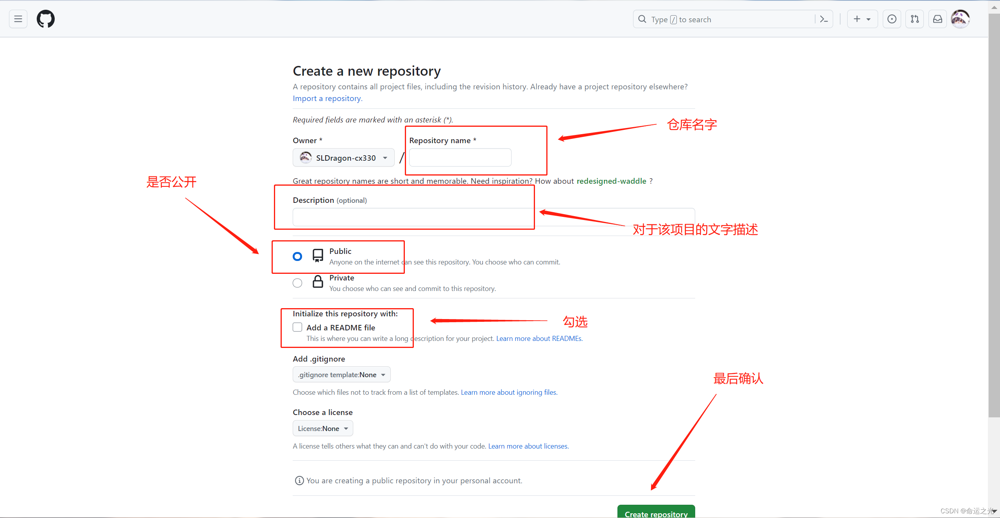
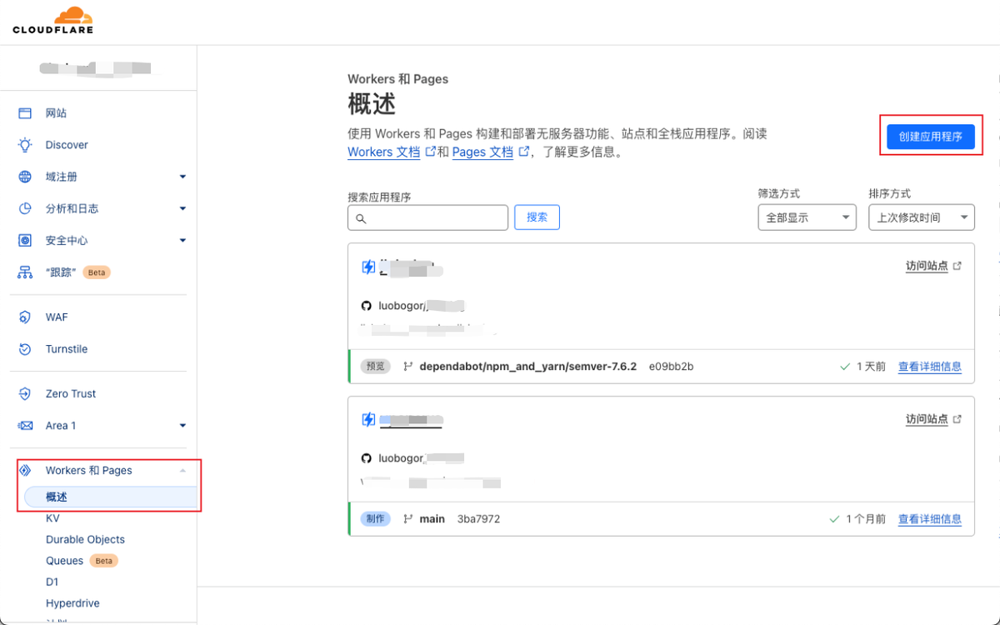

> 服务器过期了，备案太麻烦，域名还要等20天？
> 别慌，这篇教你**一分钱不花**，用 GitHub + Cloudflare Pages 部署网站，有手就行。

<!-- more -->

---

## 一、先搞清楚：无服务器部署是啥原理？

简单说：
- **GitHub** 帮你存代码（当网盘用）
- **Cloudflare Pages** 帮你把代码变成网站（当服务器用）

两者都是**免费的**，而且 Cloudflare 自带全球 CDN，访问速度比你那台破服务器还快。

> 缺点：只能部署静态网站（HTML/CSS/JS），不能跑 PHP、Python 后端。  
> 但博客、个人主页、文档站、展示页，完全够用了。

---

## 二、准备工作

你需要：
1. 一个 **GitHub 账号**（免费注册）
2. 一个 **Cloudflare 账号**（免费注册）
3. 一个 **域名**（可选，没有就用 Cloudflare 送的二级域名）
4. 一台能上网的设备（手机也行）
5. **带脑子**（最重要，没有的话建议先别往下看）

> 对，**手机就能搞定**，不用电脑。

---

## 三、Step 1：把代码上传到 GitHub

### 3.1 创建仓库

打开 GitHub（github.com），登录后点右上角 **+ 号 → New repository**。

仓库名随便起，比如 `my-blog`、`my-website`，**公开（Public）** 就行。



> 为啥要公开？因为 Cloudflare Pages 免费版只能读取公开仓库。  
> 不想公开？充钱开 Pro，或者看下一篇「有服务器版教程」。

### 3.2 上传代码

仓库创建好后，你有几种方式上传代码：

**方式A：网页直接传（最简单，手机也能操作）**

1. 进入仓库页面，点击 **"Add file" → "Upload files"**
2. 把你的网站文件（HTML、CSS、JS、图片）拖进去
3. 点 **"Commit changes"**

> 注意：GitHub 网页版**不支持上传文件夹**，只能传单个文件。  
> 如果文件多，建议打包成 ZIP 上传，后面用 GitHub Actions 自动解压，或者……直接看方式B。

**方式B：Git 命令行（适合电脑操作）**

```bash
# 克隆仓库到本地
git clone https://github.com/你的用户名/仓库名.git

# 把你的网站文件复制进去
cp -r 你的网站文件/* 仓库名/

# 提交上传
cd 仓库名
git add .
git commit -m "init: 上传网站"
git push origin main
```

**方式C：手机 Termux（进阶）**

如果你手机上装了 Termux，可以直接在手机上执行 Git 命令，跟电脑一样操作。

> 不会用 Termux？那还是方式A吧，网页点点点就行。

---

## 四、Step 2：连接 Cloudflare Pages

### 4.1 登录 Cloudflare

打开 [dash.cloudflare.com](https://dash.cloudflare.com)，登录你的账号。

### 4.2 创建 Pages 项目

左侧菜单找到 **"Pages"**，点击 **"创建项目"**。




选择 **"连接到 Git"**，然后授权 Cloudflare 访问你的 GitHub 账号。

### 4.3 选择仓库

在列表里找到你刚才创建的仓库，点击 **"开始设置"**。

### 4.4 配置构建设置

这里分两种情况：

**情况A：纯静态网站（只有 HTML/CSS/JS）**

- 框架预设：**None**
- 构建命令：**留空**
- 输出目录：**留空**（或者填 `.`）

**情况B：用框架生成的网站（比如 Hexo、VitePress、Astro）**

- 框架预设：选择对应的框架
- 构建命令：填框架的构建命令（比如 `npm run build`）
- 输出目录：填构建输出目录（比如 `dist`、`public`）

> 如果你用的是我博客那个 Firefly 模板，框架预设选 **Astro**，构建命令填 `npm run build`，输出目录填 `dist`。

### 4.5 部署

点 **"保存并部署"**，等个 1-2 分钟，Cloudflare 会自动构建并部署你的网站。

部署成功后，你会看到一个类似 `https://xxx.pages.dev` 的链接，**这就是你的网站地址**。

---

## 五、Step 3：绑定自己的域名（可选）

Cloudflare 送的 `pages.dev` 域名能用，但如果你想用自己的域名，比如 `www.yourname.top`，可以按下面步骤操作。

### 5.1 在 Cloudflare 添加域名

1. 进入你的 Pages 项目，点击 **"自定义域"**
2. 输入你的域名，比如 `www.yourname.top`
3. 点 **"继续"**

### 5.2 修改域名 DNS

Cloudflare 会提示你添加一条 **CNAME 记录**。

去你的域名服务商（比如阿里云、腾讯云、Namecheap），找到 DNS 解析设置，添加一条记录：

| 类型 | 主机记录 | 记录值 |
|------|----------|--------|
| CNAME | www | 你的pages.dev地址 |

等 DNS 生效（通常几分钟到几小时），访问 `www.yourname.top` 就能看到你的网站了。

> 注意：如果域名没备案，**不要解析到国内服务器**，否则会被墙。  
> 但解析到 Cloudflare Pages 是**完全没问题**的，因为服务器在国外。

---

## 六、Step 4：自动更新（一劳永逸）

最爽的是：以后你**改代码只需要 push 到 GitHub**，Cloudflare Pages 会自动重新构建部署。

```bash
git add .
git commit -m "update: 改了首页"
git push origin main
```

 push 完等 1-2 分钟，网站就自动更新了，**不用手动上传，不用 FTP，不用登录服务器**。

---

## 七、常见问题

**Q：GitHub 访问不了怎么办？**
> 开梯子，或者用手机流量试试。GitHub 在国内时灵时不灵，习惯就好。

**Q：Cloudflare Pages 免费版有限制吗？**
> 有，但够用：每月 500 次构建，每天 10 万次请求。个人博客完全用不完。

**Q：能部署动态网站吗？**
> 不能，静态网站 only。要跑后端（PHP、Python、数据库），看下一篇「有服务器版教程」。

**Q：网站文件太大怎么办？**
> GitHub 单个文件限制 100MB，仓库总大小建议不超过 1GB。图片多的话，建议用图床（比如 SM.MS、Imgur）外链引用。

---

## 结语

这套方案的核心就一句话：**GitHub 存代码，Cloudflare 当服务器，域名自己买，全程不花钱。**

适合人群：
- 学生党（没钱买服务器）
- 个人博客（不需要后端）
- 项目展示页（给客户看效果）
- 临时站点（活动页、作品集）

如果你看完这篇还是不会，**建议直接复制粘贴我的仓库改改用**，或者……回来问我。

> 下一篇预告：《有服务器怎么部署网站？宝塔/1Panel 一键建站教程》
