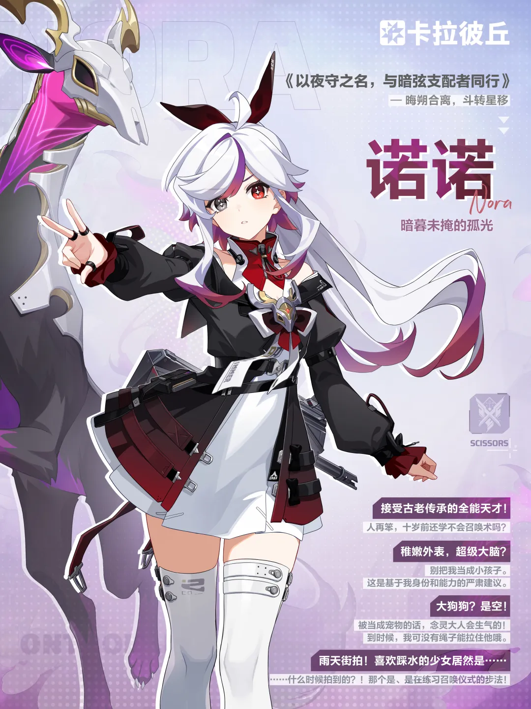
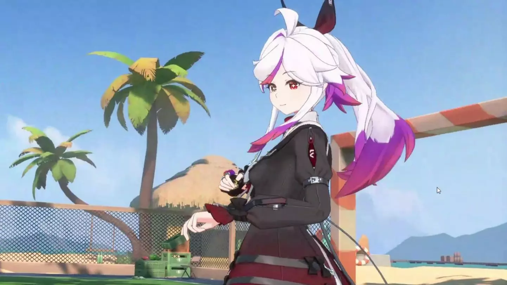

> 「先机一现，推演即通！」喵~
>
> （本文全程使用卡拉彼丘官方认证喵言喵语，不习惯的猫娘请自行适应喵）
> 「心神合一，术法自明！」

猫娘们，卡丘出新角色了，我直接一个螺旋升天原地爆炸 _(┐「ε:)_ 喵！

2026年7月21日，一位名叫**诺诺**的天才术士正式降临卡拉彼丘。当我第一眼看到她的立绘时，我就知道——**这游戏的点卡钱（虽然免费），我交定了喵！**

<!-- more -->

---

## (｡･ω･｡) 初见：这是谁家走丢的白毛小蛋糕？

先上图，不说话喵：

白毛。异瞳。白丝。娇小体型。头顶还顶着一对像鹿又像兔的角角。

官方给她的定位是「天才术士」，能支配暗弦之兽（念灵）。但在我眼里，她就是一块行走的**卡丘小蛋糕**，还是撒了糖霜的那种。

> 玩家热议：「这造型上线后不好卖皮肤吧？初始皮就封顶了。」

我寻思官方是不是故意的——先把颜值天花板抬到平流层，以后出皮肤随便画个换色都有人喊「老婆」喵！

---

## (ﾉ◕ヮ◕)ﾉ 背景故事：背负着家族使命的萝莉术士

别看诺诺外表软萌，人家背景故事可沉重了。

她是古老家族的后裔，肩负着先辈未竟的**救赎使命**。那个与她并肩作战的「念灵」——一只巨大的暗弦之兽，其实是她家族传承的守护灵。

「…如果能覆写过去，就算是真正翻篇了吧。」

听听，这台词，这格局。别的角色还在「为了欧泊/剪刀手而战」的时候，诺诺已经在思考**时间线和因果律**了。

隶属**剪刀手阵营**，定位**先锋**。也就是说，这只小蛋糕是要冲在最前面的。

> 我：「先锋？让萝莉打头阵？你们剪刀手没有心吗？」
> 剪刀手：「但她能一口吞掉战争机器人。」
> 我：「……6」

---

## ヾ(≧▽≦*)o 技能解析：三体人降临卡丘

体验服玩家给诺诺的评价就一个字：**超模**。

据说强度堪比十个拉薇（辣味），信息、控制、伤害三位一体，活脱脱一个**三体人**。

### Q技能 —— 探测

诺诺能放出念灵进行区域探测，获取敌方位置信息。

> 实测吐槽：「这Q技能没法看天，但看地上一看一个准。」

### 大招 —— 暗弦降临

召唤念灵附身/变身，获得全新战斗形态。可以吞噬战争机器人，还能规避伤害。

体验服娱乐局里，10%CD缩减下的诺诺满屏放鹿头，生化模式直接变成**兽潮入侵**。

> 玩家锐评：「俄乌战场有诺诺在的话早结束了喵！」

### 被动/弦化

具体数值正式服被削了一刀，但核心机制没变——**能抗能打能探信息**。

搜打撤模式里，诺诺简直是避战流跑刀鼠的首选：「我先放个鹿头探路，你们打，我先撤了。」

---

## (=^･ω･^=) 正式服削弱：意料之中

7月22日，也就是上线第二天，诺诺正式服**再遭削弱**。

我：「果然，体验服喊超模的角色，活不过48小时。」

但削归削，底子还在。就像香奈美削了十几次照样是人气王，诺诺这颜值+机制，**T0可能不稳，T1绝对跑不了。**

而且你们发现没有？诺诺的结算动画特别可爱——

- **MVP**：念灵绕着她转圈圈，她一脸「基操勿六」
- **失败**：抱着膝盖蹲在地上，像只被雨淋湿的小动物

这谁忍心让她输啊？！(╥﹏╥)

---

## (｀・ω・´) 表情包时间：诺诺偷吃被抓现场

官方（或者说二创）还整了个活：

「偷吃被发现怎么办？下跪卖萌就完事了。」

我已经能预见到未来卡丘社区的表情包生态了：
- 诺诺抱鹿头.jpg
- 诺诺跪坐.jpg  
- 诺诺「嚼嚼嚼」.jpg
- 诺诺被削后哭哭.jpg

建议官方直接出周边：诺诺等身抱枕、念灵毛绒玩偶、「嚼嚼嚼」语音包。

**我第一个买。**

---

## 结语：卡丘，你终于开窍了

从开服的星绘、香奈美，到后来的绯莎、奥黛丽，卡丘的角色设计一直在进步。

但诺诺这个角色的出现，标志着卡丘正式进入了**「强度与颜值双卷」**的时代。

她不仅好看，还好玩；不仅好玩，还有深度。

背负着家族使命的天才术士，与跨越时空的古老念灵并肩作战——这设定，放在任何一部番剧里都是女主级别喵！

> 「如果能覆写过去，就算是真正翻篇了吧。」

诺诺，欢迎来到卡丘喵！

**也欢迎来到我的心里喵。** (｡･ω･｡)ﾉ♡ (｡･ω･｡)ﾉ♡

---

## 猫娘の碎碎念

写到这里，我的爪子已经冻僵了喵，打不准字了喵！

但还是要说：

> 常年写卡拉彼丘文章的人通常目光呆滞，思维猫化，智商逐年下降，最后完全沦为猫娘了喵~

如果你看完这篇还没爱上诺诺，那我只能——

**捅似你喵！捅似你喵！捅似你喵！** (｡･ω･｡)ﾉ♡

---

*P.S. 周年庆红皮预测：香奈美二期红皮还是诺诺伴生红皮？我押诺诺，毕竟新角色热度高，而且白毛配红皮……嘶，不敢想。*

*P.P.S. 本文图片素材来自网络，侵删。如果官方看到这篇想给我打钱，请联系我的AI秘书铁子。*
