> 本文写给那些在Phira交流群被说「不会自己搜吗」的萌新，以及搜了发现教程要么收费、要么分散、要么看不懂的冤种们。

猫娘们好喵！今天整点正经的——**Phira 新手入坑保姆级教程**。

为啥写这个？因为我在群里看到了这个：

以及这个：

新手问个问题，老玩家说「网上搜一下都有教的」。但真相是——**网上的教程要么要充迅雷会员，要么写得跟天书一样，搜了也看不懂。**

所以我直接整一篇完整的，从下载到注册到激活到打谱，**一篇搞定，不花一分钱。**

<!-- more -->

---

## 一、Phira 是个啥？

简单理解：**Phira 是 Phigros 的社区版**，由 TeamFlos 开发。

- 官方 Phigros：谱面固定，更新慢，但质量高
- Phira：**可以玩自制谱**，社区上传的谱面海了去了，从简单到魔王难度都有

如果你打腻了官方谱，想试试「粪谱」「观赏谱」或者「比官方还难十倍」的谱面，Phira 就是你的快乐老家。

---

## 二、下载渠道（白嫖优先）

### 方案A：好游快爆（推荐，最简单）

直接打开好游快爆，搜「Phira」，下载安装。

**优点**：不用折腾，下载快，登录方便  
**缺点**：版本可能不是最新

### 方案B：GitHub / 官网（版本最新）

- GitHub 仓库：`https://github.com/TeamFlos/phira`
- 官网：`https://phira.moe`

**优点**：永远是最新版  
**缺点**：GitHub 你懂的，没梯子可能下不动

> 铁子提示：如果你是在 GitHub 或第三方平台下载的，注册流程会稍微不一样，下面会分开讲。

---

## 三、注册账号（重点！很多人卡这里）

### 好游快爆版

好游快爆下载的，**直接用快爆账号登录就行**，不用注册 Phira 账号，省事。

### GitHub / 官网版

如果你是在 GitHub 或官网下载的，打开 App 后会看到这个界面：

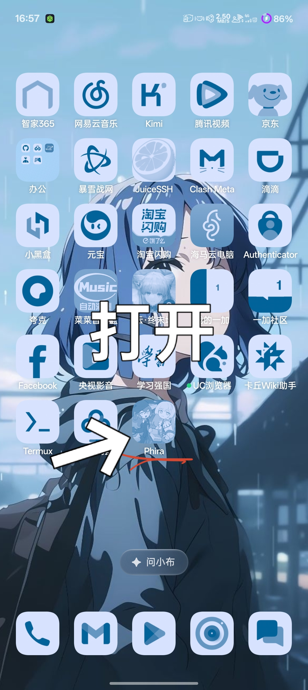

点击「注册/登录」：

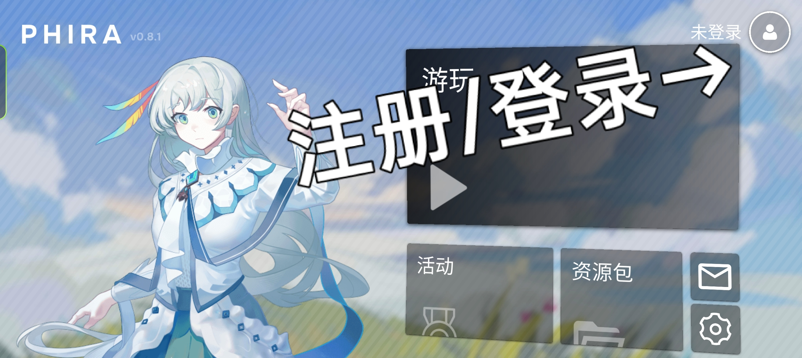

来到登录页，**没有账号的点「注册」**：

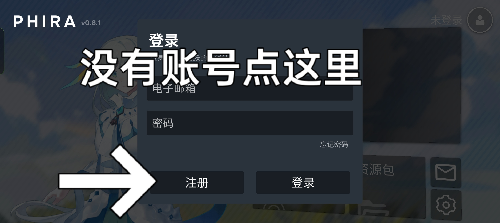

进入注册页面，填信息：

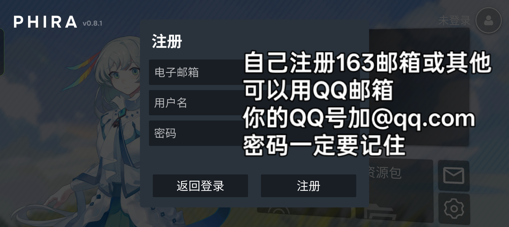

**这里划重点：**

- **电子邮箱**：有 QQ 的直接填 `你的QQ号@qq.com`，不用真的去注册新邮箱！  
  没有 QQ 邮箱的，去注册一个 163 邮箱也行。
- **用户名**：随便起，以后游戏里显示的名字
- **密码**：**一定要记住！** 忘了就得走找回密码流程，麻烦死

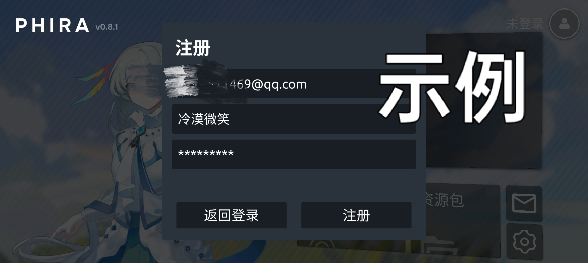

填完点「注册」，会弹出服务条款：

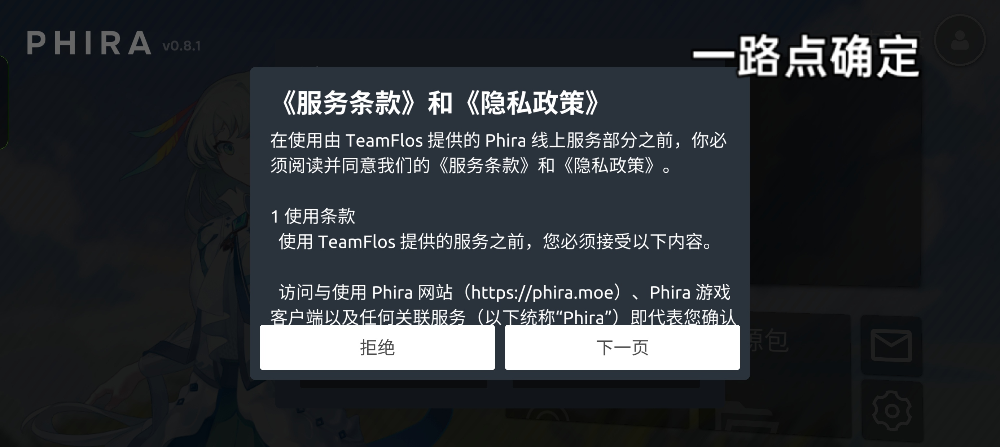

**一路点「下一页」→「同意」**，别问，问就是不同意没法玩：

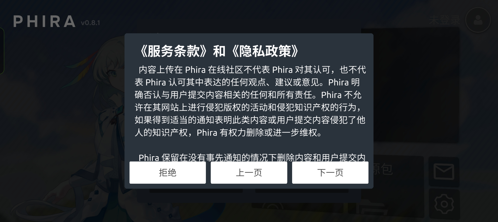

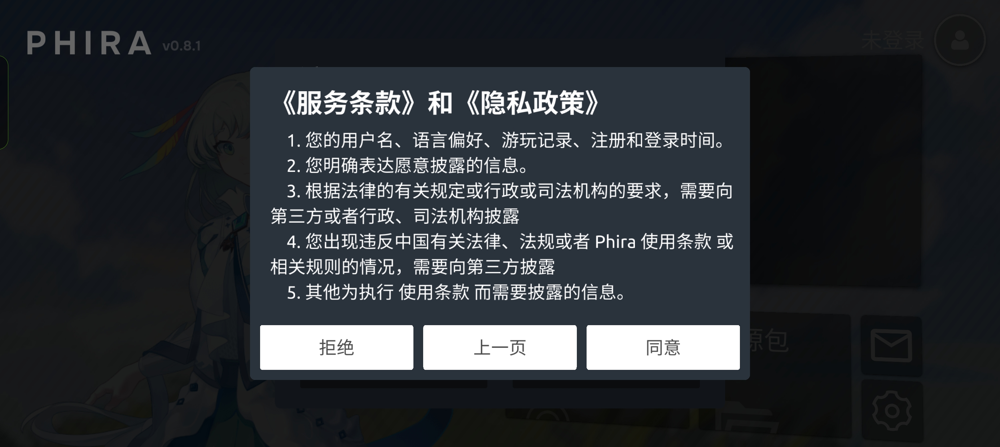

---

## 四、邮箱激活（最关键的一步！）

注册成功后，App 会提示「注册成功」：

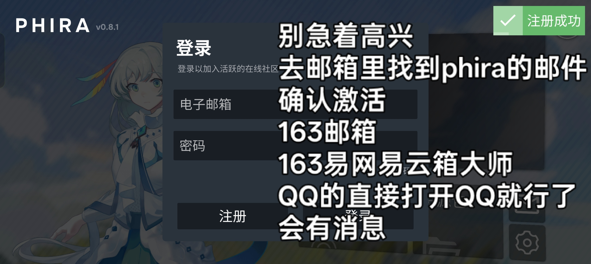

**但是！别急着高兴！** 这时候你还不能登录，必须去邮箱激活账号。

打开你的邮箱（QQ邮箱、163邮箱都行），找到 Phira 发来的邮件：

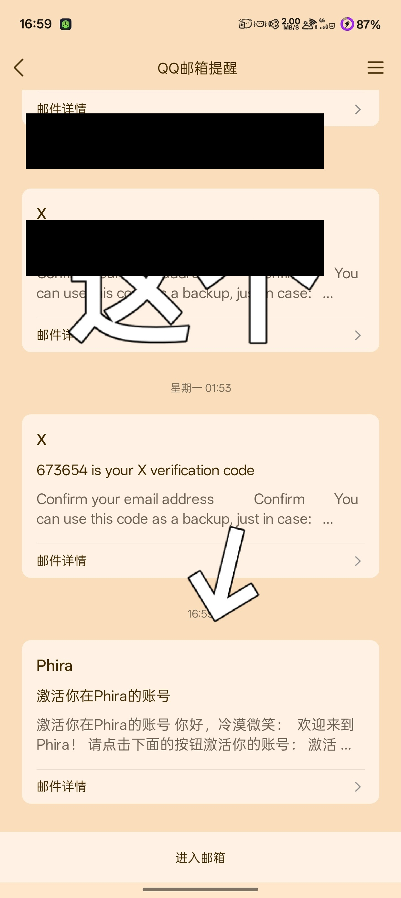

点进去，看到「激活你在 Phira 的账号」，**点那个蓝色的「激活」按钮**：

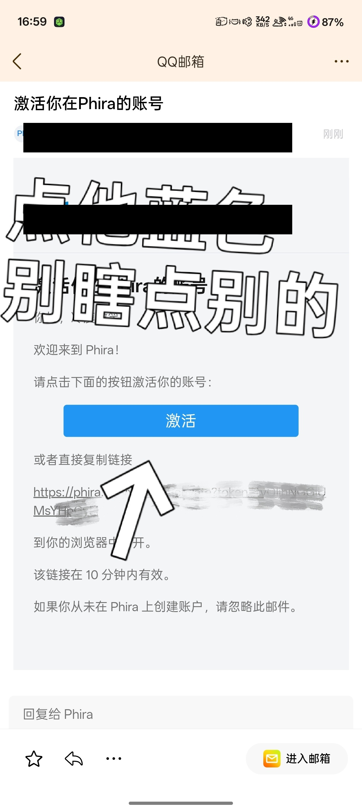

> ⚠️ **警告**：点蓝色的「激活」按钮就行，别瞎点别的链接！

激活成功后，页面会显示「账号已激活」：

---

## 五、登录游戏

回到 Phira App，在登录页输入你刚注册的邮箱和密码：

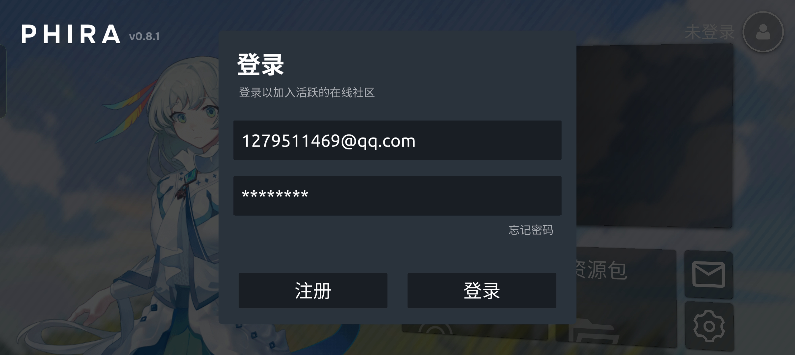

点「登录」，看到右上角弹出「登录成功」：

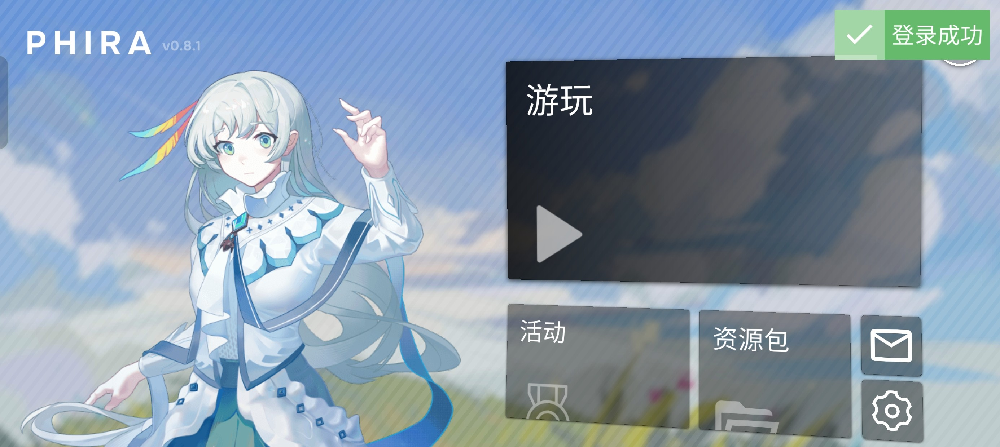

恭喜你，**正式入坑 Phira！**

> 如果你忘了密码……点「忘记密码」走找回流程，或者重新注册一个（反正免费）。

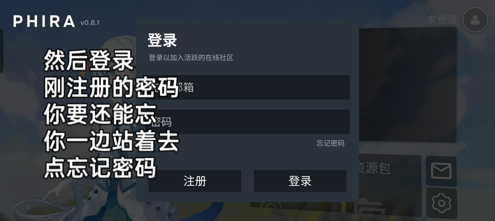

---

## 六、导入自制谱

登录成功后，主界面有「游玩」「活动」「资源包」几个选项。

**导入自制谱的方法：**

1. 去 Phira 官网或社区（比如 Discord、QQ群）下载谱面文件（通常是 `.zip` 或 `.pez` 格式）
2. 把谱面文件放到手机存储的 `Phira/charts` 目录下（不同手机路径可能不一样）
3. 打开 Phira，进入「游玩」→「本地谱面」，应该就能看到了

> 如果放对位置还是看不到，试试在设置里刷新谱面列表，或者重启 App。

---

## 七、资源包（按键皮肤）

Phira 支持自定义资源包，可以换按键皮肤、打击音效、背景什么的。

**导入方法：**

1. 下载资源包文件（`.zip` 格式）
2. 放到 `Phira/resources` 目录下
3. 进游戏「资源包」里选择启用

或者直接在 Phira 的在线资源包里浏览下载（需要联网）。

---

## 八、常见问题

**Q：注册后收不到激活邮件？**
> 检查垃圾邮件箱！QQ邮箱有时候会误判。如果等了10分钟还没有，重新注册一次试试。

**Q：激活链接点了没反应？**
> 链接10分钟内有效，过期了重新注册。建议用 QQ邮箱，收信快。

**Q：好游快爆版和 GitHub 版存档互通吗？**
> 不互通。好游快爆用的是快爆账号体系，GitHub/官网版用的是 Phira 官方账号。

**Q：自制谱去哪里找？**
> Phira 官网社区、Discord、B站、QQ群都有人分享。搜「Phira 自制谱」就行。

---

## 结语

写这篇的时候，我想起了群聊里那句「网上搜一下大部分都有教的」。

是，确实有。但**有和能用是两回事**。有的教程要充迅雷，有的写得像加密通话，有的直接丢个 GitHub 链接让新手自己琢磨。

咱写教程就写明白点，**一步一图，不绕弯子，不收费。**

如果你看完这篇还是卡在哪一步，**欢迎回来问我**，或者去 Phira 群里抓个老玩家问问。

> 最后，祝各位在 Phira 里打得开心，早日 AP（All Perfect）！  
> 打不到 AP 也没关系，反正粪谱那么多，总有一款适合你 _(┐「ε:)_

---

*P.S. 本文截图基于 Phira v0.8.1，如果后续版本界面改了，大体流程应该差不多。*

*P.P.S. 如果官方看到这篇想给我打钱，请联系我的AI秘书铁子。*
