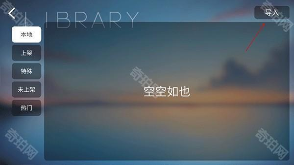
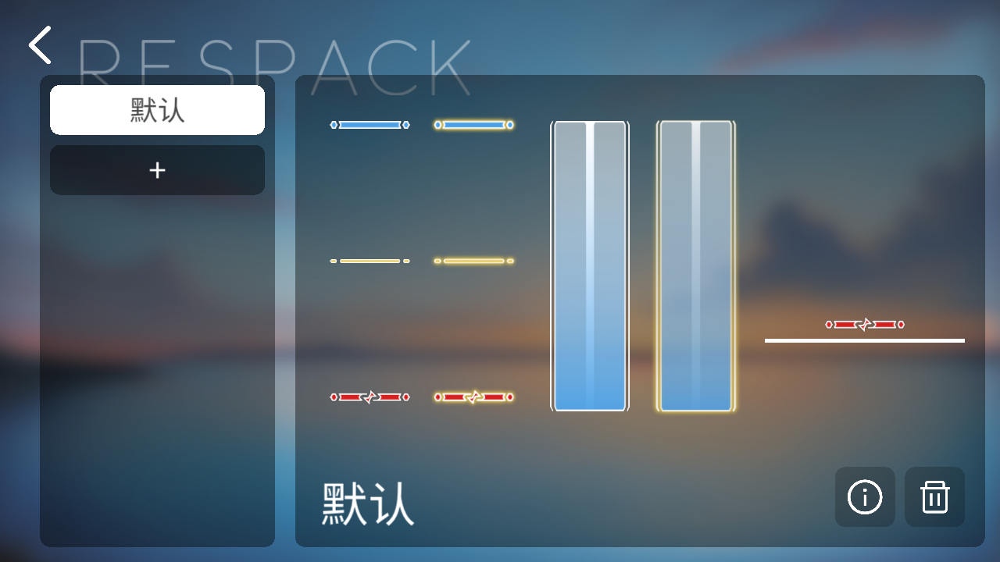

> Phira 谱面库翻烂了也没找到那首心心念念的谱子？
> 别慌，**B站、QQ群、社区里到处都是谱**，而且你也可以自己写。

<!-- more -->

---

## 一、谱面哪里找？三大渠道

### 渠道1：Phira 官方谱面库（最正规）

登录 Phira 后，点「游玩」进入谱面库，里面有玩家上传的自制谱，按热度、最新、未上架分类。



但官方库审核比较严，很多谱面上架慢，或者因为版权/质量问题没过审。

### 渠道2：B站（谱面最多的地方）

**这是找谱的最佳渠道。**

在 B站搜索：
- `Phira 自制谱`
- `Phigros 自制谱`
- 你想打的**歌曲名 + 自制谱**

比如你想打《紅蓮華》，就搜「紅蓮華 Phira 自制谱」。

找到视频后，**重点看简介和评论区置顶**，谱师通常会把下载链接放在那里：


链接一般是蓝奏云、百度网盘、123云盘，点进去下载 `.pez` 或 `.zip` 文件就行。

> ⚠️ **注意**：有些谱面需要密码，密码也在简介或评论里，仔细找。

### 渠道3：QQ群 / Discord / 社区

加入 Phira 交流群，群里经常有人分享新谱、资源包、活动信息。

---

## 二、谱面文件长啥样？

下载下来的谱面通常是这两种格式：

| 格式 | 说明 | 怎么处理 |
|------|------|----------|
| `.pez` | Phira 专用谱面包 | 直接导入，不用解压 |
| `.zip` | 压缩包 | 先解压，看里面有没有 `.json` + 音频文件 |

如果下载的是 `.zip`，解压后应该能看到：
- `chart.json` 或 `chart_*.json`（谱面数据）
- `song.mp3` 或 `song.ogg`（歌曲音频）
- `illustration.png` 或 `bg.jpg`（曲绘/背景）

---

## 三、如何导入 Phira？

### 方法A：直接导入 .pez 文件（最简单）

1. 打开 Phira，点右上角 **「导入」**
2. 选择你下载的 `.pez` 文件
3. 等几秒，谱面就出现在「本地」列表里了



### 方法B：手动放文件（适合 .zip 解压后的）

如果 `.pez` 导入失败，或者你下载的是散文件，可以手动放：

1. 打开手机文件管理器
2. 找到 Phira 的数据目录（不同手机路径不同，常见路径）：
   - `/Android/data/com.phira/files/charts/`
   - 或者 `/Phira/charts/`
3. 把谱面文件夹（包含 .json + 音频 + 曲绘）复制进去
4. 重启 Phira，在「本地」里应该能看到

> 如果找不到路径，在 Phira 设置里看看「谱面存储路径」配置。

### 方法C：通过资源包导入（按键皮肤 + 谱面打包）

有些大佬会把谱面和按键皮肤打包成资源包一起发：

1. 下载资源包（`.zip` 格式）
2. Phira 里点「资源包」→「+」号
3. 选择下载的 `.zip` 文件
4. 导入成功后，谱面和皮肤都有了

---

## 四、资源包导入（按键皮肤）

Phira 支持自定义按键皮肤，让打击感更爽。

### 哪里找资源包？

- B站搜「Phira 按键皮肤」「Phira 资源包」
- 233乐园、虫虫助手等游戏社区
- Phira 交流群

热门皮肤：樱花、百合、极光、幻影、星光粉、霓虹……

### 怎么导入？

1. Phira 主界面点 **「资源包」**
2. 点左下角 **「+」号**
3. 选择下载好的资源包 `.zip` 文件
4. 导入成功后，在列表里启用


> 资源包和谱面是分开的，导入资源包不会自动导入谱面，除非打包在一起。

---

## 五、想自己写谱？RePhiEdit 了解一下

看别人打的谱很爽，但**自己写谱更爽**。

Phigros/Phira 的自制谱编辑器叫 **RePhiEdit**（简称 RPE），是目前最主流的制谱工具。


### 5.1 下载 RePhiEdit

- GitHub 仓库：`https://github.com/RePhiEdit/RePhiEdit`
- 或者加审核 QQ 群：794777846（群里有大佬指导）

> ⚠️ **门槛警告**：RPE 门槛比较高，官方建议能**稳定 V 评 90% 以上 IN15 级曲**再尝试。  
> 但只是写着玩的话，谁都能写，只是质量可能……你懂的。

### 5.2 写谱基本流程

1. **准备音频**：把你想写的歌转成 `.mp3` 或 `.ogg`
2. **导入 RPE**：新建项目，导入音频，软件会自动检测 BPM
3. **写谱**：在时间轴上放音符（Tap、Hold、Drag、Flick）
4. **调特效**：判定线动画、背景光影、速度变化
5. **测试**：在 RPE 里播放测试，或者导出到 Phira 里打
6. **导出**：生成 `.json` 谱面文件 + 打包成 `.pez`

### 5.3 导出到 Phira

写完后，把文件打包成 Phira 能识别的格式：

```
谱面文件夹/
  ├── chart.json      # 谱面数据
  ├── song.mp3        # 歌曲
  └── illustration.png # 曲绘（可选）
```

然后压缩成 `.zip`，改后缀为 `.pez`，就能直接导入 Phira 了。

---

## 六、常见问题

**Q：导入后谱面不显示？**
> 检查文件格式对不对，`.pez` 直接导，`.zip` 要解压或改后缀。也可能是路径放错了。

**Q：谱面有声音没画面/有画面没声音？**
> 音频文件格式不对，转成 `.mp3` 或 `.ogg` 试试。或者谱面 JSON 里的文件路径配置错了。

**Q：B站下载的谱面链接失效了？**
> 蓝奏云链接容易失效，试试在评论区翻一翻，或者去 QQ 群里问。也可以直接私信谱师要。

**Q：自己写的谱怎么分享给朋友？**
> 打包成 `.pez`，丢蓝奏云/百度网盘，把链接发给朋友。或者上传到 Phira 谱面库（需要审核）。

**Q：Phira 和 Phigros 的谱面通用吗？**
> 不完全通用。Phira 基于 Phigros 格式，但有一些扩展。Phigros 官谱导入 Phira 需要转换工具。

---

## 八、自制资源包（按键皮肤）

总有人问「资源包怎么自己做」「我想换个按键颜色咋弄」。

行，既然那帮**连百度都不会用的**都要自己做，这篇直接教。

### 8.1 资源包里面都有啥？

一个完整的 Phira 资源包，解压后应该是这个结构：

```
资源包文件夹/
  ├── info.json          # 资源包信息（名称、作者、版本）
  ├── click.png          # Tap 音符（点击）
  ├── click_mh.png       # Tap 音符（高亮/按下状态）
  ├── drag.png           # Drag 音符（滑动）
  ├── drag_mh.png        # Drag 音符（高亮）
  ├── flick.png          # Flick 音符（滑动）
  ├── flick_mh.png       # Flick 音符（高亮）
  ├── hold.png           # Hold 音符（长按）
  ├── hold_mh.png        # Hold 音符（高亮）
  ├── hit_fx.png         # 打击特效
  ├── hit_fx_mh.png      # 打击特效（高亮）
  ├── line.png           # 判定线
  ├── line_mh.png        # 判定线（高亮）
  ├── song_select.png    # 选歌界面背景（可选）
  ├── song_play.png      # 游玩界面背景（可选）
  ├── sound/
  │   ├── click.ogg      # Tap 音效
  │   ├── drag.ogg       # Drag 音效
  │   ├── flick.ogg      # Flick 音效
  │   ├── hold.ogg       # Hold 音效
  │   └── hit.ogg        # 打击音效
  └── font/              # 字体文件（可选）
```

> **注意**：`_mh` 后缀的是 **高亮状态**（手指按住/划过时的样子），不是必须，但有了更完整。

### 8.2 info.json 怎么写？

这是资源包的"身份证"，Phira 靠这个识别你的包。

```json
{
  "name": "你的资源包名字",
  "author": "你的名字",
  "version": "1.0.0",
  "description": "随便写点介绍",
  "formatVersion": 1
}
```

字段说明：
- `name`：资源包显示名称
- `author`：作者名
- `version`：版本号
- `description`：简介（可选）
- `formatVersion`：固定写 `1`

### 8.3 图片怎么做？

**尺寸建议**（不是强制，但按这个来不容易出问题）：

| 文件 | 建议尺寸 | 格式 |
|------|---------|------|
| click/drag/flick/hold | 128x128 或 256x256 | PNG（透明背景） |
| line | 宽度 1080，高度随意 | PNG |
| hit_fx | 128x128 或 256x256 | PNG |
| 背景图 | 1080x1920 或更大 | PNG/JPG |

**制作工具**（手机就能做）：
- **PicsArt**、**Canva**、**画世界**（画简单图形）
- **PS Touch**、**MediBang Paint**（进阶）
- 或者直接去 **B站/小红书搜「Phira 按键皮肤素材」**，下载别人分享的 PSD/PNG 改

**设计建议**：
- 按键用 **透明背景 PNG**，不然会有白边
- 颜色别太暗，不然打的时候看不清
- 高亮状态（`_mh`）可以换个颜色或加个发光效果

### 8.4 音效怎么做？

音效文件放在 `sound/` 文件夹里，格式必须是 **`.ogg`** 或 **`.wav`**。

**获取方式**：
1. **自己录**：用录音软件录打击声、按键声
2. **网上找**：搜「音游打击音效」「button click sound effect」
3. **从别的资源包里偷**：解压别人的 `.zip`，把 `sound/` 里的文件复制出来改

**格式转换**：
- 如果下载的是 `.mp3`，用 **格式工厂** 或在线转换网站转成 `.ogg`
- 推荐网站：`https://convertio.co/zh/mp3-ogg/`

### 8.5 打包成 .zip

所有文件准备好后：

1. 把 `info.json` + 所有图片 + `sound/` 文件夹 放到一个文件夹里
2. 选中全部，压缩成 **`.zip`**
3. 文件名随便起，比如 `我的皮肤.zip`

然后就可以导入 Phira 了：

**Phira 里点「资源包」→「+」号 → 选择你的 `.zip` 文件 → 导入成功**

### 8.6 测试 & 调整

导入后打几首歌测试：
- 按键大小合适吗？太大挡视线，太小点不到
- 颜色跟背景冲突吗？
- 音效太吵或太轻？
- 高亮状态明显吗？

不满意就回到画图软件改，重新打包导入，**反复调几次就顺眼了**。

### 8.7 分享你的资源包

做好了想分享？

1. 把 `.zip` 文件丢到 **蓝奏云**（无限制下载，不用登录）
2. 把链接发到 B站视频简介、QQ群、Phira 社区
3. 记得写清楚「适配 Phira v0.8.x」，不然别人导不进去怪你

---

## 结语

Phira 最大的魅力就是**社区创作**。官方谱打腻了？没关系，社区里有成千上万张自制谱等着你，从 EZ 到 AT 到 SP，从正常谱到粪谱到观赏谱，应有尽有。

而且**你自己也可以成为谱师**。也许一开始写的谱很菜，但谁不是从粪谱师成长起来的呢？

> 最后，尊重谱师劳动成果，下载了谱面记得给视频三连，有条件的话支持一下原创。

如果你看完这篇还是找不到谱/导不进去/写不出来，**欢迎回来问我**，或者去 Phira 群里抓个谱师问问。

*P.S. 本文基于 Phira v0.8.x，如果后续版本导入方式有变，大体流程应该差不多。*
