> 本文最后更新于 2026-07-26，基于 AstrBot 最新稳定版及官方视频教程整理。  
> 如果你跟着步骤走还是踩坑了，欢迎截图甩我，随叫随到 ( •̀ ω •́ )✧

<!-- more -->

---

## 一、AstrBot 是啥？能干啥？

**AstrBot** 是一个开源的一站式 Agent 聊天机器人平台，说人话就是：  
你把 AI 大模型（DeepSeek、GPT、Gemini 啥的）接进去，它就能帮你在 **QQ、QQ频道、微信、Telegram、飞书、钉钉、Discord** 这些平台上自动回复消息。

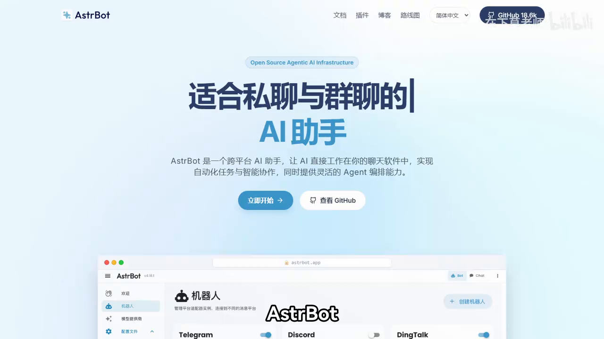

它不只是聊天机器人，更是 Agent 平台：支持子代理（Sub-Agent）协同工作、复杂任务编排、工具调用与上下文管理，让 AI 具备真正的行动力。

**电脑版 vs 手机版？**

| 对比项 | 电脑版（本文） | 手机版 |
|--------|-------------|--------|
| 运行环境 | 服务器 / VPS / 本地电脑 / NAS | Termux / 随身设备 |
| 稳定性 | 7×24 挂机，稳如老狗 | 随手机休眠可能掉线 |
| 性能 | 能跑大模型，插件随便装 | 轻量，适合尝鲜 |
| 推荐度 | ⭐⭐⭐⭐⭐ | ⭐⭐⭐ |

**结论**：想正经用、长期用、群聊里当管理员的，直接上电脑版/服务器版，别折腾手机 (￣▽￣)"

---

## 二、准备工作

动手之前先把这几样凑齐，省得中途卡壳：

### 2.1 硬件准备（物理机部署）

如果你打算用家里闲置电脑或工控机当服务器：

- **X86 电脑**（台式机/笔记本/小主机都行，ARM 也可以但视频里演示的是 X86）
- **U 盘**（≥8GB，用来写 Ubuntu 系统镜像）
- **网线**（推荐有线连接，比 WiFi 稳）

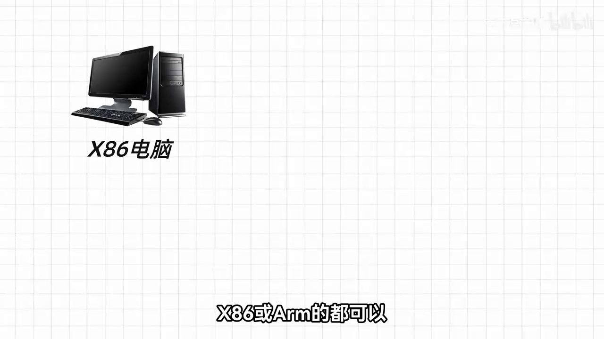

### 2.2 软件准备

- **BalenaEtcher**：把 Ubuntu 镜像写入 U 盘的工具  
  👉 https://etcher.balena.io
- **Ubuntu 镜像**：推荐 **Ubuntu 24.04 LTS**  
  👉 https://ubuntu.com/download/desktop
- **MobaXterm**：Windows 下的 SSH 连接工具（比 PuTTY 好用一百倍）  
  👉 https://mobaxterm.mobatek.net
- **大模型 API Key**：推荐 **硅基流动（SiliconCloud）** 或 **MiniMax**、**DeepSeek** 等
- **一个 QQ 小号**：**千万别用主号！** 机器人有一定封号风险，用小号隔离。建议用养了几个月、有正常使用记录的号，新号容易被风控。

### 2.3 如果你用云服务器/VPS

那硬件和系统安装这一步可以跳过，直接看「方式二：Docker Compose」或「方式三：CasaOS」。

---

## 三、方式一：物理机 + CasaOS 部署（视频主打方式）

视频里 UP 主演示的是：拿一台闲置小主机，装 Ubuntu → 装 CasaOS → 应用商店一键装 AstrBot。这种方式最适合家里有闲置电脑、想搭 NAS + 机器人一体机的兄弟。

### 3.1 制作 Ubuntu 启动盘

1. 下载 BalenaEtcher 和 Ubuntu 24.04 ISO 镜像
2. 打开 BalenaEtcher → 「从文件烧录」→ 选择 Ubuntu ISO → 选择你的 U 盘 → 「现在烧录！」

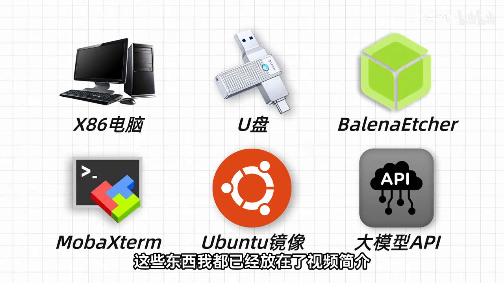

3. 烧录完成后，把 U 盘插到要装系统的电脑上

### 3.2 安装 Ubuntu 系统

1. 开机按 **F12/F2/Del**（不同主板按键不同）进入 BIOS，选择 U 盘启动
2. 进入 Ubuntu 安装界面，语言选 **中文（简体）**
3. 键盘布局默认，网络连接建议插网线自动连上
4. 选择「**正常安装**」，勾选「**安装第三方软件**」（为了显卡驱动和 WiFi 驱动）
5. 安装类型选「**擦除磁盘并安装 Ubuntu**」——⚠️ **注意这会清空硬盘所有数据，别选错了！**
6. 时区默认 **上海（Shanghai, China）**
7. 创建用户：填用户名、密码，**记住这个密码，后面 SSH 登录要用**
8. 等进度条跑完，重启，拔掉 U 盘

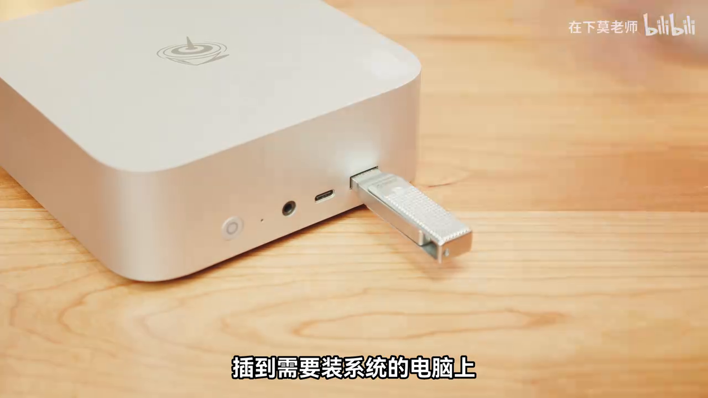

### 3.3 安装 OpenSSH + 查看 IP

开机进入 Ubuntu 桌面后，打开终端：

```bash
sudo apt install openssh-server -y
ip addr
```

找到类似 `192.168.31.226` 这样的内网 IP，记下来。

### 3.4 SSH 远程连接（MobaXterm）

1. 打开 MobaXterm → 「Session」→ 「SSH」
2. Remote host 填刚才的 IP（如 `192.168.31.226`）
3. Username 填你创建的用户名
4. 点 OK，输入密码，连上！

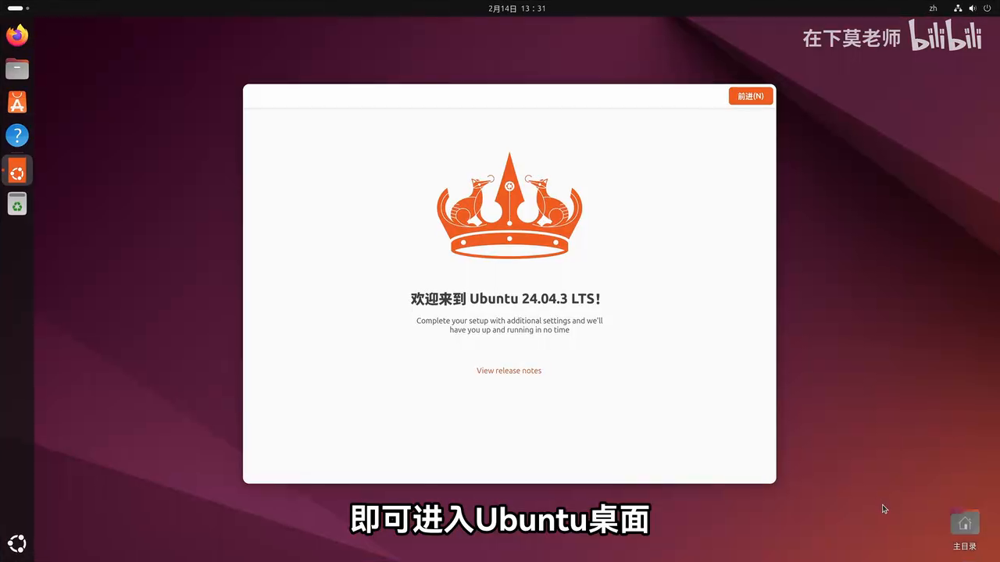

### 3.5 换国内软件源（加速下载）

Ubuntu 默认源在国外，下载慢得离谱。用 **LinuxMirrors** 一键换源：

```bash
bash <(curl -sSL https://linuxmirrors.cn/main.sh)
```

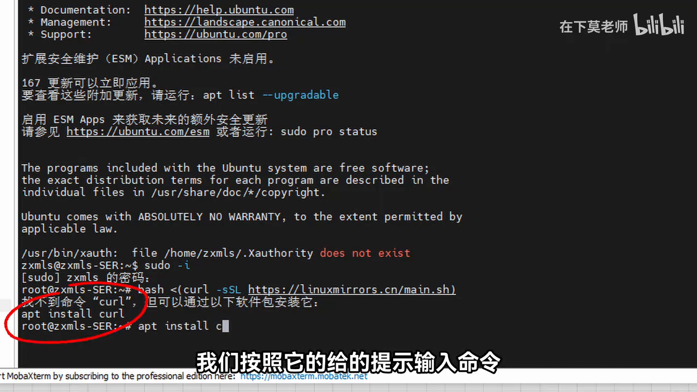

脚本会让你选择镜像站，推荐选：
- **清华大学**（tuna）
- **阿里云**（aliyun）
- **中科大**（ustc）

选完回车，自动完成换源。

### 3.6 安装 CasaOS

CasaOS 是一个轻量级 NAS 系统，自带应用商店，可以像装手机 App 一样一键安装 AstrBot。

```bash
curl -fsSL https://get.casaos.io | sudo bash
```

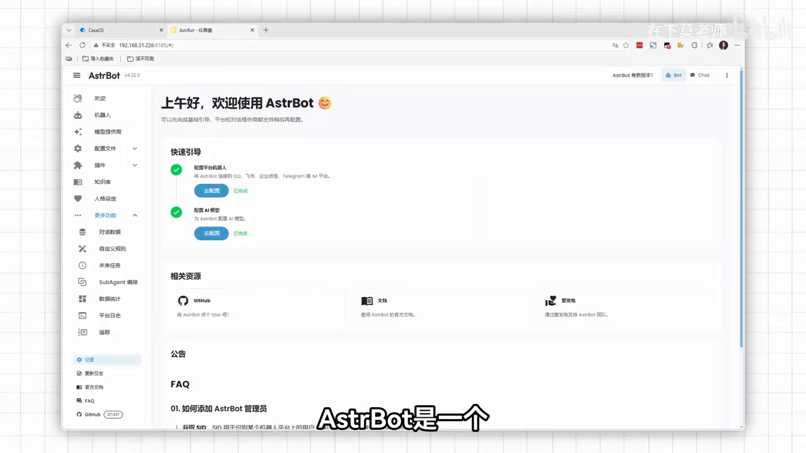

装完会显示访问地址，一般是 `http://你的IP:80`。浏览器打开，注册一个 CasaOS 账号。

### 3.7 一键安装 AstrBot

1. 进入 CasaOS 桌面 → 「App Store」应用商店
2. 右上角搜索 **AstrBot**

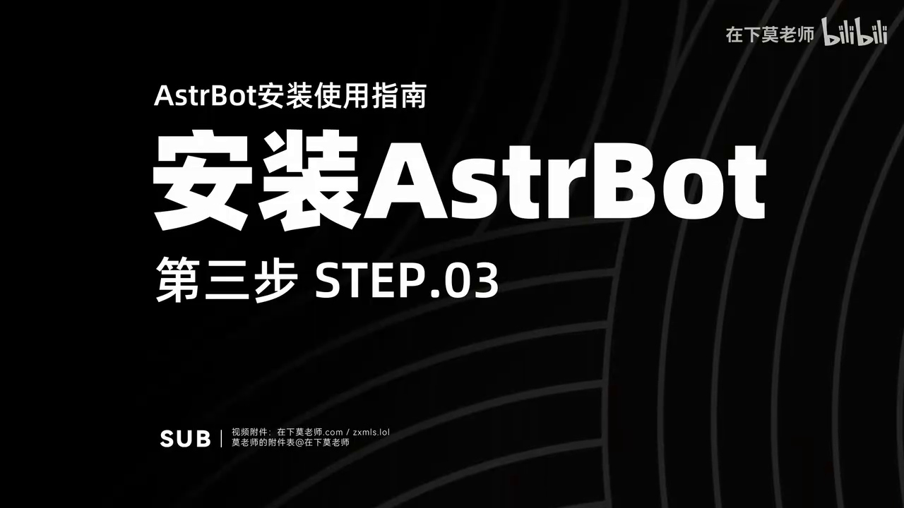

3. 点击安装，CasaOS 会自动拉取 Docker 镜像、配置端口映射
4. 等图标从灰色变彩色，就表示装好了

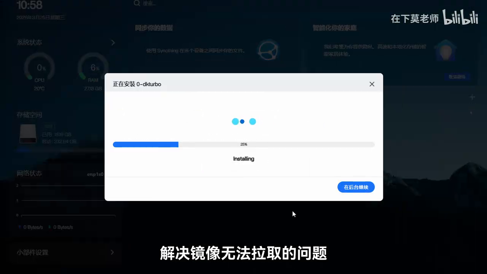

5. 点击 AstrBot 图标进入，或者浏览器直接访问 `http://你的IP:6185`

> 如果应用商店搜不到 AstrBot，或者你想手动控制版本，直接看下面的「方式二：Docker Compose」。

---

## 四、方式二：Docker Compose 部署（通用推荐）

如果你已经有服务器、VPS、或者不想装 CasaOS，用 Docker Compose 是最干净的方式。

### 4.1 安装 Docker

```bash
# Ubuntu / Debian / 大多数 Linux
curl -fsSL https://get.docker.com | sh
sudo systemctl enable --now docker

# 验证
docker --version
docker compose version
```

国内机器拉镜像可能慢，建议配个加速源：

```bash
sudo mkdir -p /etc/docker
sudo tee /etc/docker/daemon.json <<-'EOF'
{
  "registry-mirrors": [
    "https://docker.m.daocloud.io",
    "https://docker.xuanyuan.me",
    "https://docker.hlmirror.com"
  ]
}
EOF
sudo systemctl daemon-reload
sudo systemctl restart docker
```

### 4.2 一键拉起 AstrBot + NapCat

官方提供了现成的 Compose 文件，AstrBot 和 NapCat 一起跑：

```bash
mkdir astrbot && cd astrbot
wget https://raw.githubusercontent.com/NapNeko/NapCat-Docker/main/compose/astrbot.yml
sudo docker compose -f astrbot.yml up -d
```

> 如果 `wget` 拉不下来（GitHub 抽风），手动创建 `astrbot.yml`：

```yaml
version: '3.8'
services:
  astrbot:
    image: soulter/astrbot:latest
    container_name: astrbot
    ports:
      - "6185:6185"
      - "6199:6199"
      - "11451:11451"
    volumes:
      - ./data:/AstrBot/data
      - /etc/localtime:/etc/localtime:ro
    restart: unless-stopped

  napcat:
    image: mlikiowa/napcat-docker:latest
    container_name: napcat
    ports:
      - "3000:3000"
      - "3001:3001"
      - "6099:6099"
    environment:
      - NAPCAT_GID=0
      - NAPCAT_UID=0
    restart: unless-stopped
```

国内机器把镜像前缀改成加速源，比如 `m.daocloud.io/docker.io/soulter/astrbot:latest`。

### 4.3 查看状态

```bash
# 看 AstrBot 日志
sudo docker logs -f astrbot

# 看 NapCat 日志（里面会有 WebUI 地址和 Token）
sudo docker logs -f napcat
```

看到 AstrBot 日志输出「管理面板已启动」就算成功了。

---

## 五、方式三：其他部署方式

| 方式 | 命令/说明 | 适合人群 |
|------|----------|---------|
| **uv 手动部署** | `pip install uv` → `uvx astrbot init` → `uvx astrbot run` | 想改源码、二次开发 |
| **Windows 一键安装器** | GitHub Releases 下载 `.exe` 安装器 | 纯小白，只用 Windows |
| **宝塔 / 1Panel** | 应用商店搜索 AstrBot 一键安装 | 已有面板环境 |
| **Arch Linux AUR** | `yay -S astrbot-git` | Arch 用户 |

---

## 六、AstrBot 初始配置

### 6.1 登录 WebUI

浏览器打开：`http://你的服务器IP:6185`

- 默认账号：`astrbot`
- 默认密码：`astrbot`
- **首次登录会强制要求改密码**，改完才能进面板 (ﾉ*･ω･)ﾉ

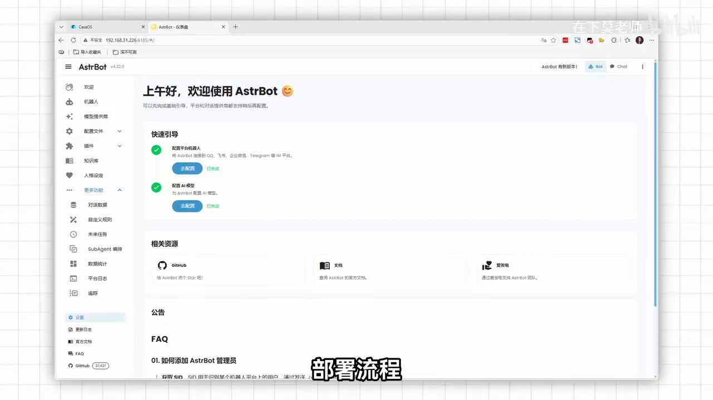

### 6.2 熟悉面板

登录后左侧菜单：
- **欢迎**：仪表盘，显示消息统计、运行时间
- **机器人**：管理平台机器人实例
- **模型提供商**：配置 AI 大模型（对话、Agent、TTS、STT、Embedding、Rerank）
- **配置文件**：为不同机器人分别设置配置
- **插件**：插件市场和已安装插件
- **知识库**：管理文档知识库
- **人格设定**：机器人的性格、人设
- **更多功能**：对话数据、自定义规则、未来任务、SubAgent、平台日志、MCP 等

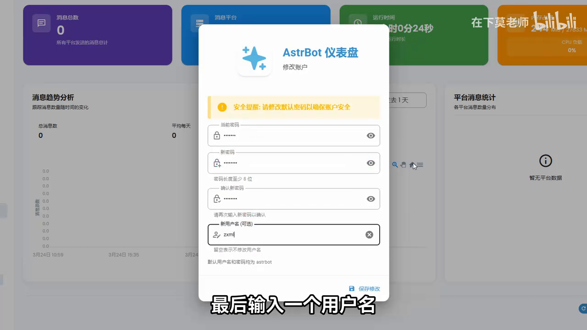

---

## 七、接入 AI 大模型（给机器人装大脑）

### 7.1 模型提供商配置

点击左侧「模型提供商」→ 「新增」。AstrBot 支持的提供商非常多：

**对话模型**：OpenAI Compatible、Google Gemini、Anthropic、Kimi、Moonshot、MiniMax、DeepSeek、Zhipu、xAI、NVIDIA、Azure OpenAI、Ollama、SiliconFlow 等。

**其他类型**：
- **Agent 执行器**：Dify、Coze、阿里云百炼等第三方 Agent 平台
- **语音转文字（STT）**：OpenAI Whisper、FunASR 等
- **文字转语音（TTS）**：OpenAI TTS、Edge TTS、FishAudio、Azure TTS、MiniMax TTS 等
- **嵌入（Embedding）**：OpenAI Embedding、Ollama Embedding 等，用于知识库和长期记忆
- **重排序（Rerank）**：vLLM Rerank、Jina AI 等，用于优化知识库检索结果

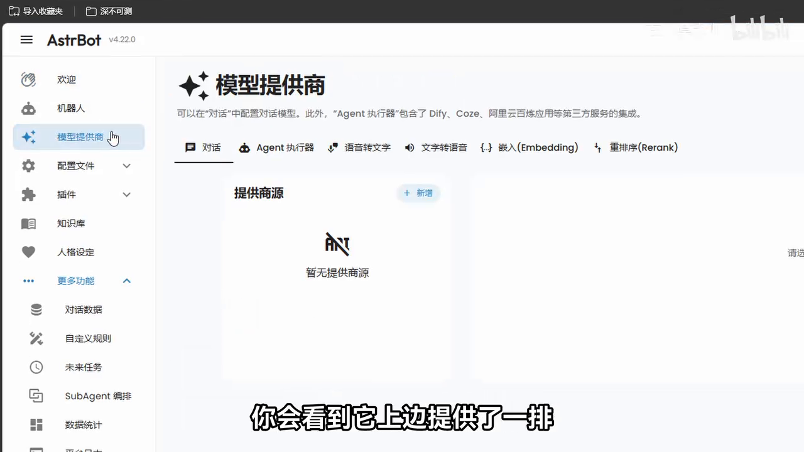

### 7.2 以 MiniMax 为例（视频演示）

1. 选择「OpenAI Compatible」（因为 MiniMax 兼容 OpenAI 格式）
2. 填写：
   - **ID**：`MINIMAX`（自定义，方便识别）
   - **API Key**：从 MiniMax 官网获取的 Key
   - **API Base URL**：`https://api.minimax.chat/v1`

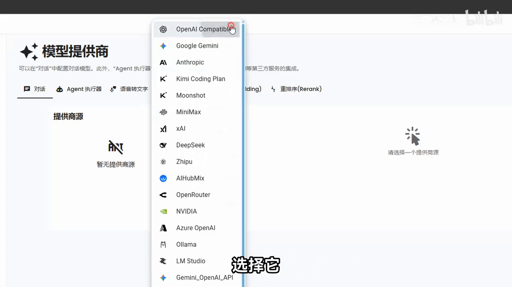

3. 保存后，点击「获取模型列表」或「自定义模型」
4. 添加模型，如 `MiniMax-M2.7`
5. 点击模型旁边的开关，启用它

> ⚠️ **注意**：不同提供商的 Base URL 不一样，且都需要在末尾加上 `/v1`。如果提供商文档给的地址没加，你自己补上。

### 7.3 配置文件管理

AstrBot 支持为不同机器人分别设置配置文件：

1. 左侧「配置文件」→ 「新建配置文件」
2. 给配置文件起个名字（比如 `default`、`群聊专用`）

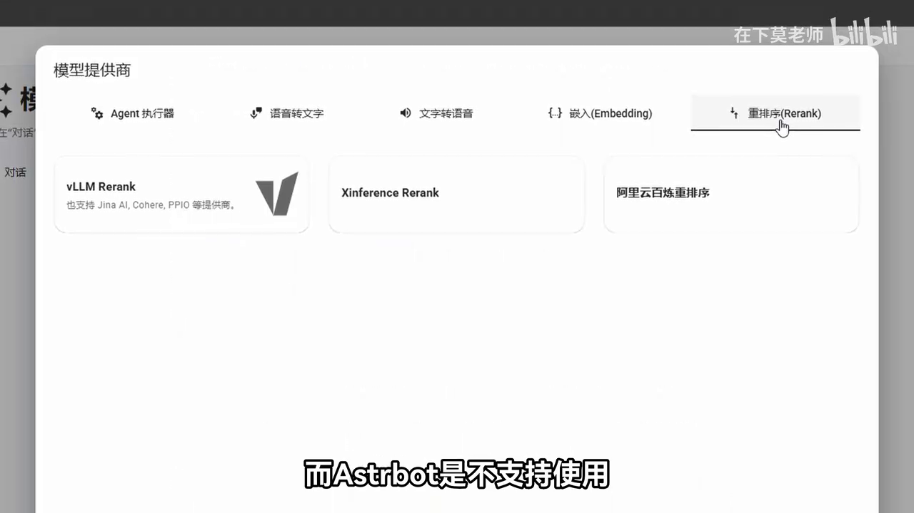

3. 在「AI 配置」里选择：
   - **默认对话模型**：主用的聊天模型
   - **回退对话模型列表**：主模型挂了自动切换的备用模型
   - **默认图片转述模型**：用于多模态（看图说话）
   - **Agent 执行方式**：内置 Agent 或第三方

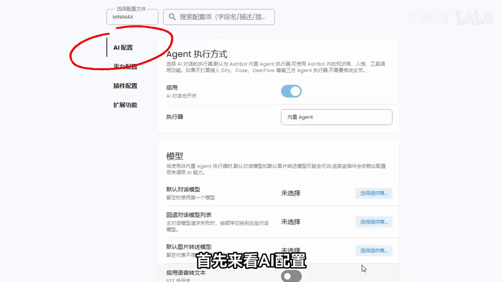

4. 在「平台配置」里选择接入的 IM 平台（QQ、微信等）
5. 在「插件配置」里选择该机器人加载哪些插件

---

## 八、接入 QQ

AstrBot 支持两种 QQ 接入方式：

### 8.1 方式 A：QQ 官方开放平台（推荐，视频演示）

适合正式机器人，稳定性高，但需要申请。

1. 访问 [QQ 开放平台](https://q.qq.com) → 创建机器人
2. 获取 **AppID** 和 **Secret**

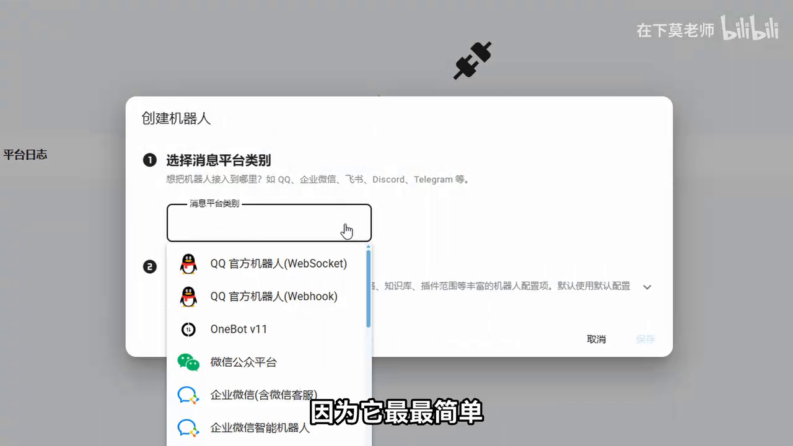

3. 回到 AstrBot → 「平台配置」→ 选择「QQ 官方机器人」
4. 填写：
   - **AppID**：从开放平台复制
   - **Secret**：从开放平台复制
   - **机器人名称**：自定义
5. 保存，机器人就上线了

> 首次使用可能需要先在 QQ 里搜索你的机器人并添加好友。

### 8.2 方式 B：NapCat（QQ 个人号，适合私聊群聊）

适合用个人 QQ 号当机器人，无需申请，但有小号风控风险。

**NapCat 配置**：

1. 浏览器打开 `http://服务器IP:6099`，输入 Token（看 `docker logs napcat`）
2. 点「网络配置」→ 「新建」→ 选择 **WebSocket 客户端**
3. 填写：
   - **名称**：`astrbot`
   - **URL**：`ws://你的服务器IP:6199/ws`（⚠️ 末尾必须有 `/ws`）
   - **消息格式**：`Array`
   - **Token**：设一个强密码
4. 保存

**AstrBot 对接**：

1. AstrBot 面板 → 「消息平台」→ 「新增适配器」
2. 选择 **「接入 QQ 个人号（aiocqhttp）」**

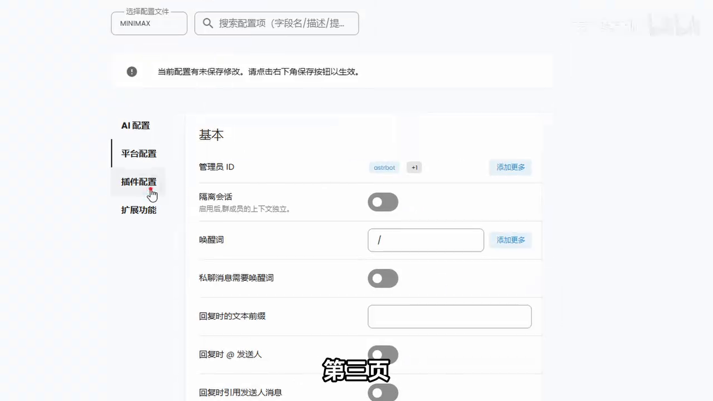

3. 填写：
   - **反向 WebSocket 主机地址**：`0.0.0.0`
   - **端口**：`6199`
   - **Token**：和 NapCat 那边一模一样的密码
4. 保存 → 重启 AstrBot

重启后看到日志输出 **「aiocqhttp(OneBot v11) 适配器已连接」** 就稳了 🤝

### 8.3 管理员权限配置

机器人刚上线时，你发命令它可能回复「没有权限」。你需要把自己的 QQ 用户 ID 加到管理员列表：

1. 在 QQ 里私聊机器人，发送 `/sid`
2. 机器人会返回你的用户 ID（一串字母数字）
3. 回到 AstrBot 面板 → 「平台配置」→ 「管理员 ID」

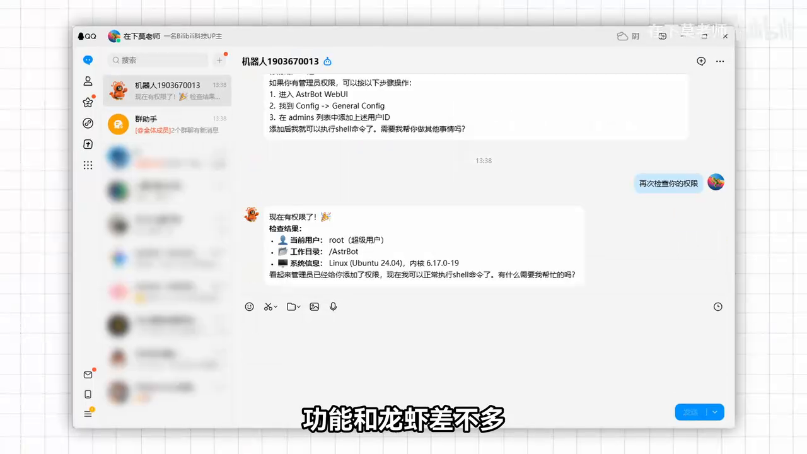

4. 点击「添加」，把刚才的 ID 贴进去
5. 保存，现在你有管理员权限了

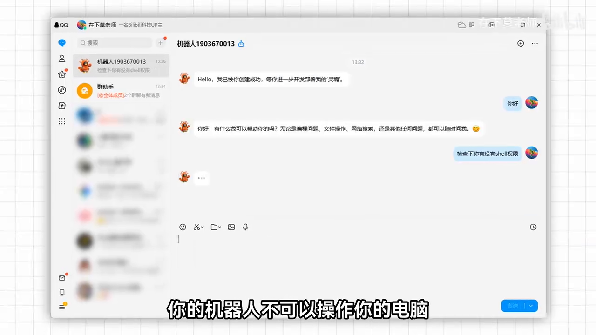

---

## 九、本地模型部署（Ollama）

如果你不想花钱调 API，或者想离线运行，可以用 Ollama 在本地跑模型。

### 9.1 安装 Ollama

**方式 1：Docker Compose（推荐，与 AstrBot 同机）**

```yaml
version: '3.8'
services:
  ollama:
    image: ollama/ollama:latest
    container_name: ollama
    ports:
      - "11434:11434"
    volumes:
      - ./ollama:/root/.ollama
    environment:
      - OLLAMA_ORIGINS=*
    restart: unless-stopped
```

```bash
docker compose up -d
```

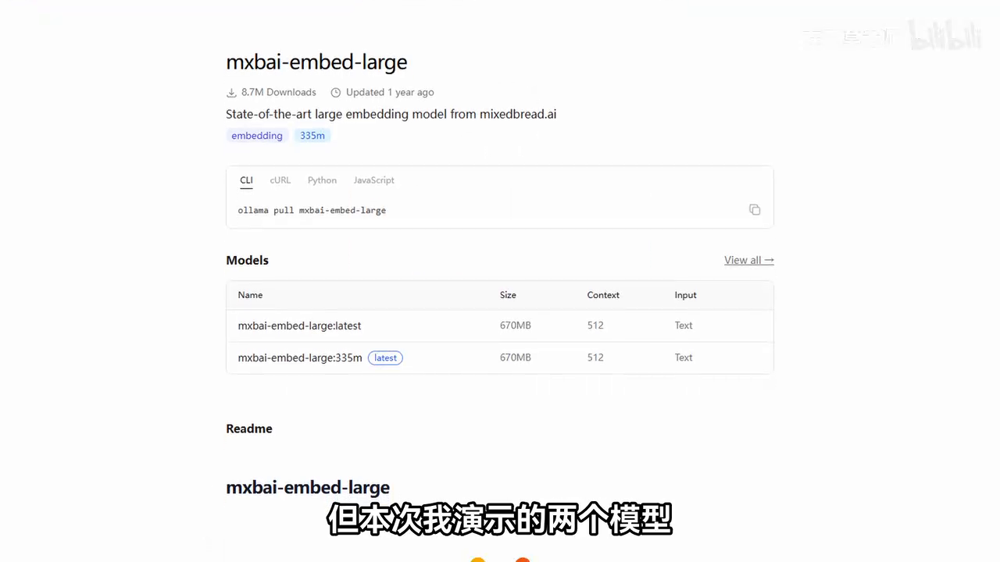

**方式 2：官方脚本**

```bash
curl -fsSL https://ollama.com/install.sh | sh
```

### 9.2 下载模型

```bash
# 下载聊天模型
docker exec ollama ollama pull llama3.2

# 下载嵌入模型（用于知识库）
docker exec ollama ollama pull mxbai-embed-large

# 下载视觉模型（看图说话）
docker exec ollama ollama pull moondream
```

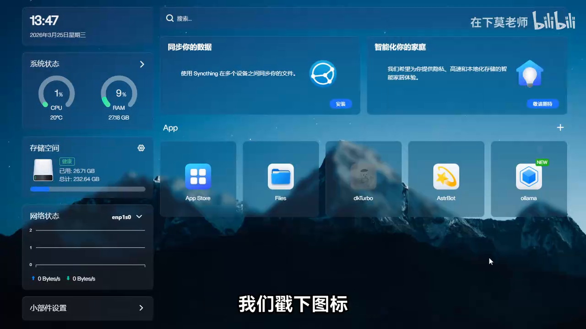

> 如果你直接在宿主机装的 Ollama（不是 Docker），去掉 `docker exec ollama` 前缀。

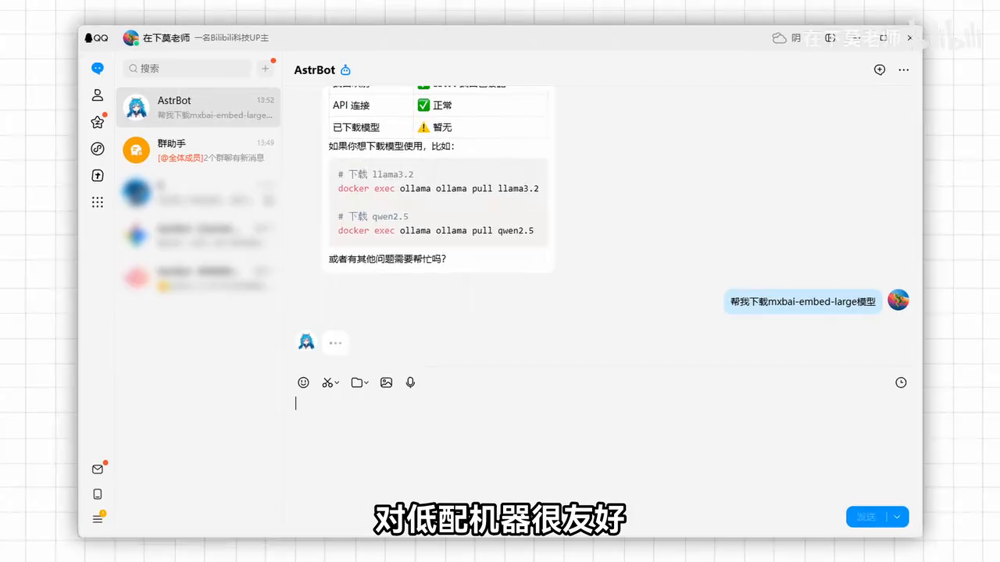

### 9.3 AstrBot 接入 Ollama

1. 「模型提供商」→ 「新增」→ 选择 **Ollama**
2. 填写：
   - **ID**：`OLLAMA`
   - **API Key**：随便填，比如 `1234`（Ollama 本地不需要验证）
   - **API Base URL**：`http://你的服务器局域网IP:11434/v1`

   > ⚠️ **重点**：即使 Ollama 和 AstrBot 在同一台机器，也**不能填 `localhost` 或 `127.0.0.1`**！必须填局域网 IP（如 `http://192.168.31.226:11434/v1`），否则 AstrBot 找不到服务。

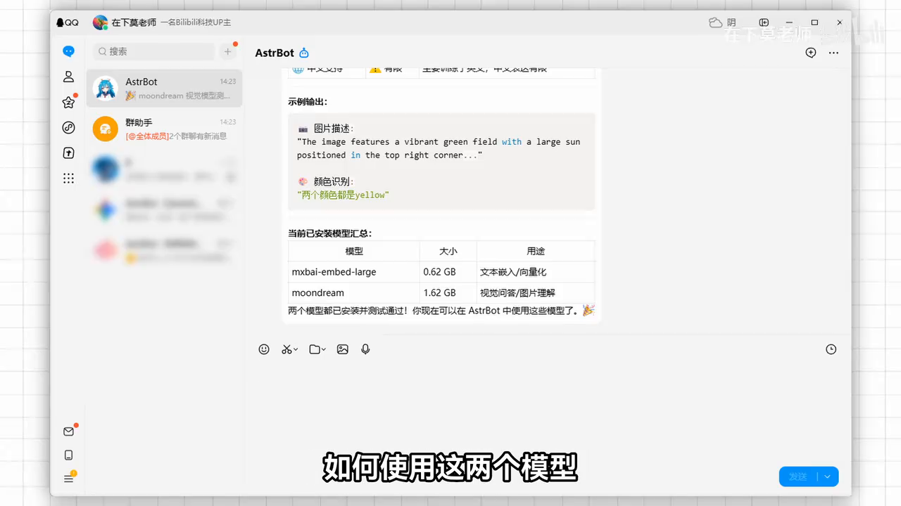

3. 保存 → 点击「获取模型列表」或手动添加模型 ID（如 `llama3.2`、`mxbai-embed-large`）
4. 启用模型

---

## 十、插件与扩展

### 10.1 插件市场

AstrBot 面板 → 「插件」→ 「插件市场」，挑喜欢的点「安装」：

- **LivingMemory**：长期记忆插件，让机器人记住每个群友的喜好和聊天历史
- **QQ群管插件**：自动禁言、踢人、关键词过滤
- **表情包生成器**：AI 生成沙雕表情包
- **点歌插件**：支持网易云、QQ音乐、B站
- **万能解析器**：解析抖音、B站、小红书、Instagram 链接
- **语音合成/点歌/传话筒** 等


装完重启 AstrBot 生效。

### 10.2 LivingMemory 长期记忆（视频演示）

这个插件很骚，能让机器人记住你们聊过啥：

1. 插件市场搜索 **LivingMemory** → 安装
2. 进入插件配置 → 选择 Embedding 模型（如 `OLLAMA/mxbai-embed-large`）

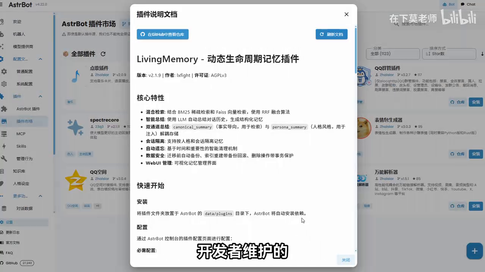

3. 选择 LLM 模型（用于总结记忆）
4. 启用 WebUI 管理面板（可选）
5. 保存后，机器人在聊天中会自动提取关键信息存入记忆

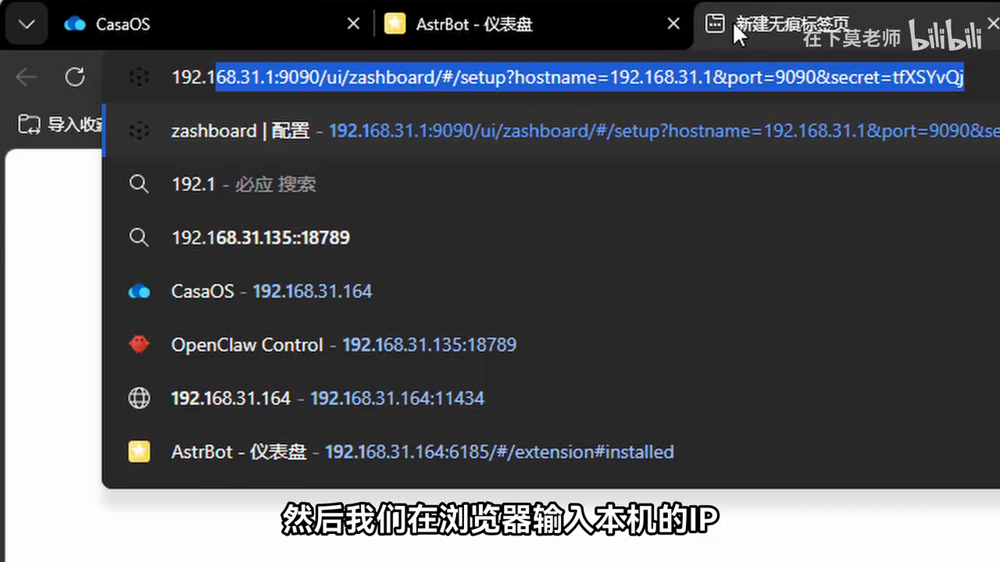

---

## 十一、知识库

想让机器人基于你的文档回答问题？上知识库。

### 11.1 创建知识库

1. AstrBot 面板 → 「知识库」→ 「创建知识库」
2. 填名称、选图标、选 Embedding 模型（如 `mxbai-embed-large`）

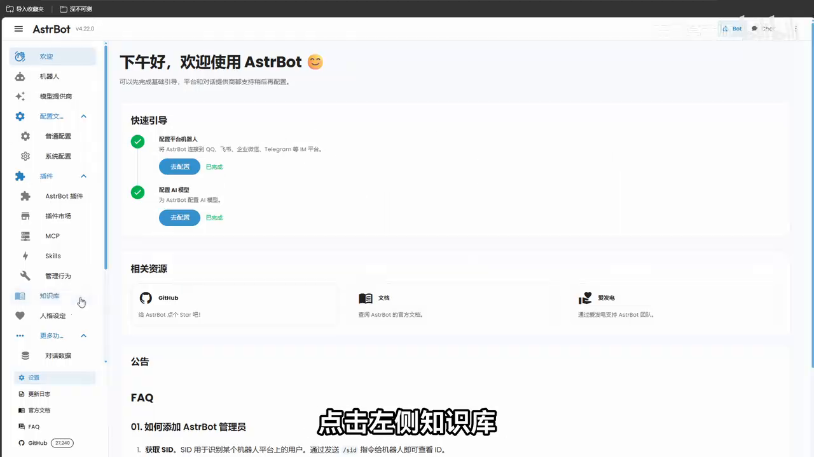

3. 创建

### 11.2 上传文档

1. 进入知识库 → 「上传文档」
2. 支持 PDF、Word、TXT、Markdown 等格式

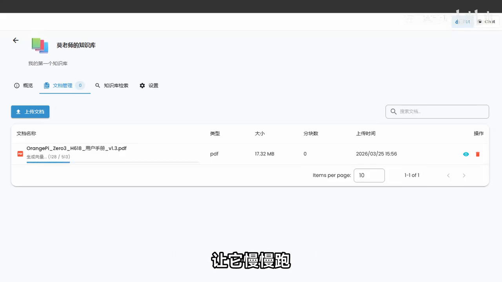

3. 上传后系统会自动分块、向量化
4. 等「分块数」显示数字（如 513 块），就表示处理完了

### 11.3 在机器人配置中启用知识库

1. 「配置文件」→ 选择你的配置 → 「知识库」
2. 「知识库列表」→ 选择刚才创建的知识库
3. 启用「Agentic 知识库检索」
4. 保存

### 11.4 网页搜索（免费 Tavily）

除了本地文档，还可以让机器人联网搜索：

1. 注册 [Tavily](https://tavily.com)（有免费额度）
2. 获取 API Key
3. AstrBot → 「配置文件」→ 「网页搜索」→ 启用
4. 选择提供商 `tavily`，填入 API Key
5. 机器人就能实时查百度、谷歌了

---

## 十二、高级功能速览

### 12.1 Skills（技能）

在「Skills」页面，你可以上传自定义技能文件（`.md` 格式），让机器人掌握特定能力。需要在「使用电脑能力」中把运行环境设为 `local` 或 `sandbox` 才能正常使用。


### 12.2 SubAgent 编排

把复杂任务拆给多个子代理完成。在「SubAgent 编排」里配置不同的 Agent 角色，主 Agent 会自动把任务分派给它们。

### 12.3 未来任务（Cron Job）

在「未来任务」里设置定时任务，比如每天早上 8 点让机器人在群里发天气预报。

### 12.4 MCP（Model Context Protocol）

在「MCP」页面添加 MCP 服务器，扩展机器人的工具调用能力。MCP 是 Anthropic 推出的开放协议，可以让 AI 调用各种外部工具。

### 12.5 平台日志

机器人出问题了？去「平台日志」看实时日志，DEBUG 级别可以看到最详细的报错信息。

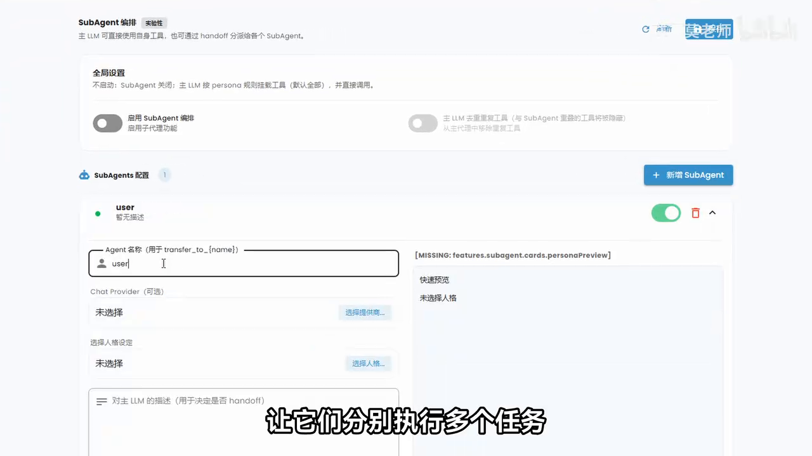

---

## 十三、常见问题排查（踩坑大全）

### Q1：AstrBot 启动失败 / 端口被占用

```bash
sudo lsof -i :6185
sudo lsof -i :6199
# 杀掉占用进程，或者改 AstrBot 端口
```

### Q2：NapCat 连不上 AstrBot

- 检查防火墙/安全组是否放行了 6199 端口
- 检查 URL 末尾是否有 `/ws`
- 检查两边 Token 是否完全一致
- Docker 部署检查容器网络

### Q3：QQ 扫码后秒掉线 / 被封号

- 换号！新号必死，用老号
- 登录后别在手机上点「退出登录」，要点「隐身」或「切换账号」

### Q4：Ollama 模型连不上

- **必须填局域网 IP**，不能填 `localhost` 或 `127.0.0.1`
- 检查 Ollama 容器/服务是否正常运行
- 浏览器访问 `http://IP:11434` 应该显示 `Ollama is running`

### Q5：机器人回复「没有权限」

- 在 QQ 里发 `/sid` 获取你的用户 ID
- 加到 AstrBot 的「管理员 ID」列表里

### Q6：插件安装失败 / GitHub 加速

国内访问 GitHub 慢，插件市场安装时可以选择加速源：
- `https://gh-proxy.com/`
- `https://ghproxy.cn/`
- `https://gh.llkk.cc/`

### Q7：Windows Defender 报毒

- AstrBot 和 NapCat 都是开源的，没毒，放心加白名单
- Windows 安全中心 → 排除项 → 添加 AstrBot 文件夹

### Q8：怎么 24 小时挂机？

- **Docker**：已配 `restart: unless-stopped`，服务器重启自动拉起
- **手动部署**：用 `systemd` 或 `pm2` 守护进程

---

## 十四、总结：四步搞定

懒得看上面长篇大论？记住这四步：

1. **跑起来**：CasaOS 一键装 / Docker Compose 拉起 AstrBot
2. **接 AI**：填 API Key，选模型，开聊
3. **连 QQ**：QQ 开放平台 或 NapCat 扫码登录
4. **加功能**：装插件、建知识库、配长期记忆

完事儿！去群里 @ 你的机器人试试效果吧 ヽ(✿ﾟ▽ﾟ)ノ

---

> **延伸阅读**
> - AstrBot 官方文档：https://docs.astrbot.app
> - AstrBot GitHub：https://github.com/AstrBotDevs/AstrBot
> - NapCat 文档：https://napcat.napneko.icu
> - CasaOS 官网：https://casaos.io
> - LinuxMirrors 换源：https://linuxmirrors.cn
> - 硅基流动：https://cloud.siliconflow.cn
