> 如果你还没看过上一篇《Phira 新手入坑全攻略》，建议先去看完再来，不然你可能连游戏都没下好。
>
> 👉 **[Phira 新手入坑全攻略：从下载安装到导入谱面，一篇搞定](/posts/phira-beginner-guide)**

上一篇把**下载、注册、激活、导入谱面、换皮肤**这些「场外操作」讲完了。

这篇咱们进游戏，聊聊**场内操作**——怎么打、怎么练、怎么调设置、怎么不被粪谱气死。

<!-- more -->

---

## 一、音符类型：四种按键，别瞎点

Phira 是下落式音游，音符从屏幕上方掉下来，到判定线的时候你要做出对应操作。

但 Phira 的判定线不是固定的，它会**动**——旋转、缩放、分裂，甚至消失。这是它跟传统下落式音游最大的区别，也是劝退无数萌新的罪魁祸首。

先记住四种音符：

### 1. Tap（蓝键）——点一下

最基础的音符，蓝色，落到判定线时**点一下屏幕**就行。

> 注意：是「点」不是「戳」，屏幕戳烂了它不加分。

### 2. Hold（黄键）——按住别松

黄色长条，头落到判定线时**按住**，尾离开判定线时**松开**。

- 按住期间手指可以**轻微滑动**，不用死钉在一个点上
- 但别松太早，松早了算 Miss
- 也别松太晚，虽然 Phira 的 Hold 尾判比较宽松，但一直按着影响后面操作

### 3. Drag（红键/粉键）——滑过去

红色或粉色的音符，落到判定线时**手指滑过**即可，不需要点击。

- Drag 可以单指滑，也可以多指同时滑
- 有些谱面 Drag 会排成一条线，跟着轨迹滑就行
- 遇到满屏 Drag 别慌，**糊**过去也算（ accuracy 另说）

### 4. Flick（蓝红箭头）——划一下

带箭头的音符，落到判定线时**向箭头方向划动**。

- 可以向上划、向下划、向左划、向右划，看箭头朝向
- 划动幅度不用太大，轻轻一抹就行
- 有些谱面 Flick 会跟 Tap 重叠，这时候**先点再划**，别漏了 Tap

> 💡 **音符长啥样？** 在「资源包」里换皮肤就能看到不同风格的音符样式。默认皮肤下：Tap 是蓝色方块、Hold 是黄色长条、Drag 是红色/粉色、Flick 是带箭头的。进游戏打一首低难度谱面，四种音符都能遇到。

---

## 二、判定线与计分：不是越准越好，是越准越爽

Phira 的判定线会随音乐节奏变化，这是它跟 Phigros 一脉相承的特色。

### 判定等级

从好到坏依次是：

| 判定 | 说明 | 得分 |
|------|------|------|
| Perfect | 完美击中 | 100% |
| Good | 还不错 | 80% |
| Bad | 勉强算你击中 | 40% |
| Miss | 没打着 | 0% |

> **连击（Combo）**很重要，断连会严重影响最终得分。但有些粪谱故意设计断连点，别太上头。

### 分数与评级

- **φ (Phi)**：All Perfect，全部 Perfect，最高荣誉
- **V (Full Combo)**：全连击，但可能有 Good/Bad
- **S / A / B / C / F**：按准确率分级，F 就是「你打了个寂寞」

> 新手别一上来就追求 AP，先把 FC 拿到手再说。AP 是玄学，FC 是实力。

---

## 三、模组系统：打不过就开挂（不是）

进游戏后，选谱界面右上角有个**扳手图标**，点进去是模组设置。

有三个模组可以开：

### 1. Autoplay（自动游玩）

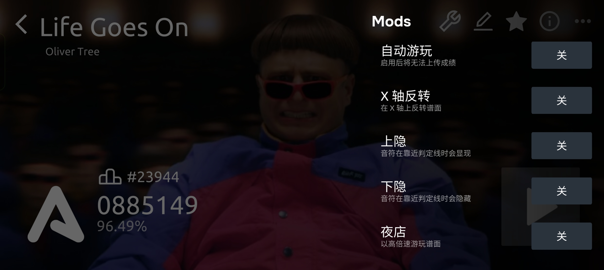

**作用**：自动帮你打，100% Perfect，用来**看谱面演出**或者**录手元视频**。

> 开了 Autoplay 打的分数**不会记录**，别想着作弊刷榜。

### 2. X轴翻转（左右镜像）

**作用**：把谱面左右翻转。

- 有些谱面左手配置特别恶心，翻转后右手打更顺手
- 也适合左撇子玩家
- 不影响分数记录

### 3. 下隐（Hidden）

**作用**：隐藏判定线以下的音符，只显示上半部分。

- 用来**练读谱**，强迫你提前看上面的音符
- 新手别开，开了更懵
- 大佬用来装逼的，你开了就是自虐

---

## 四、谱面设置：调好了打得更舒服

选谱界面右上角有个**铅笔图标**，点进去是谱面设置。

可以调这几项：

### 1. 谱面定数

显示当前谱面的难度定数（比如 14.2、15.7）。

- 这个数值是谱师写的，**可以手动改**
- 改不改不影响实际难度，只是改显示
- 有些谱师乱标定数（标个 12 实际 16），你可以自己改成合理的

### 2. 宽高比

调整谱面显示比例。

- 默认就行，除非你的屏幕特别奇葩
- 平板玩家可以适当调宽，手机玩家默认

### 3. Tip

谱面提示语，谱师写的一些话。

- 有的 Tip 是「感谢游玩」，有的 Tip 是「这谱我瞎写的」
- 可以关掉，眼不见为净

> **调完记得点保存**，不然白调。
> 
> 谱面设置里还有很多实用选项：
> 
> 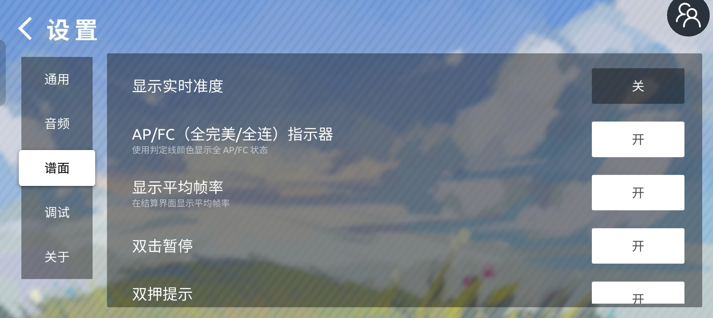
> 
> 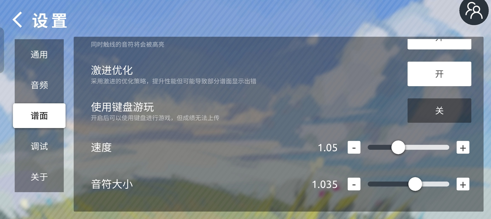
> 
> - **显示实时准度**：打歌时实时显示当前准确率
> - **AP/FC 指示器**：判定线变色提示全完美/全连状态
> - **显示平均帧率**：结算页显示 FPS
> - **激进优化**：提升性能但可能导致部分谱面显示出错
> - **使用键盘游玩**：PC 端可用键盘打歌（成绩无法上传）
> - **速度/音符大小**：调整下落速度和音符尺寸
> 
> 点右上角的 **铅笔图标** 进入「编辑谱面」，可以改谱面名、作者、曲师、画师、显示难度、预览时间、偏移、宽高比等：
> 
> 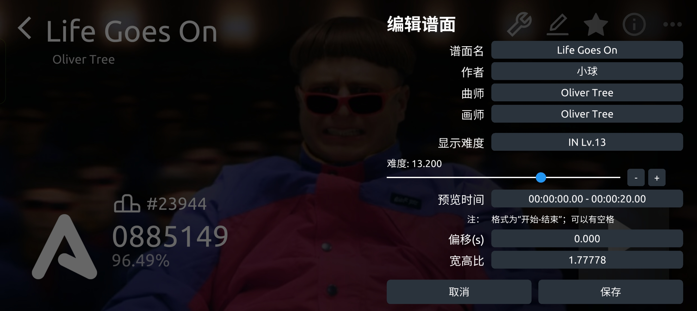
> 
> 点右上角的 **三个点** 弹出菜单，有删除、评分、练习、调整延迟、导出等功能：
> 
> 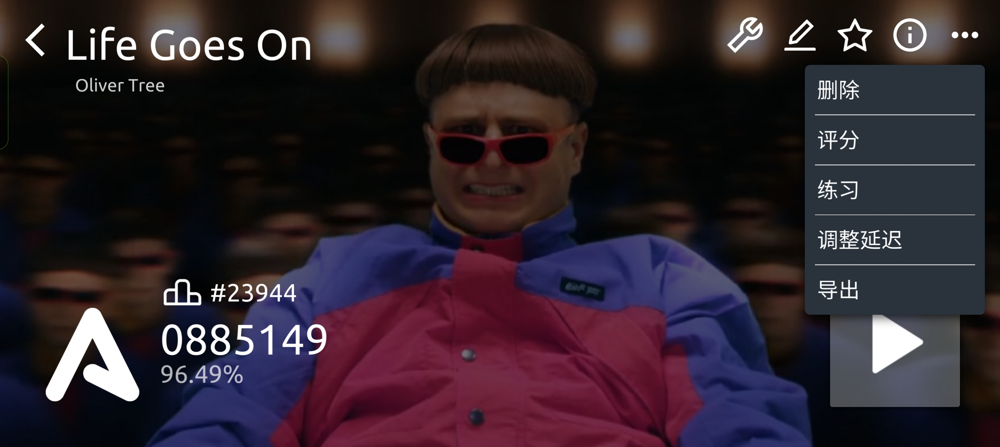
> 
> 点右上角的 **星星图标** 收藏谱面，点 **i 图标** 查看谱面详细信息（作者、曲师、谱师、难度、简介），还能跳转到作者主页：
> 
> 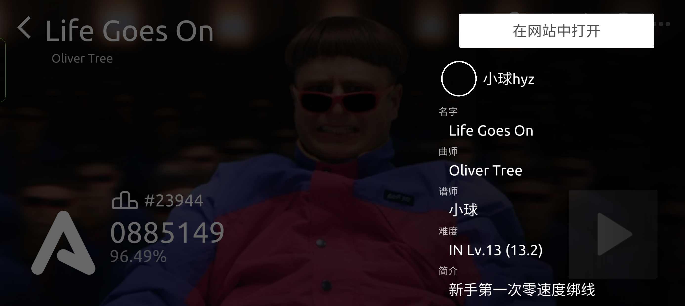

---

## 五、练习模式：打不过就练，别硬扛

选谱界面有个**「练习」按钮**，这是新手变强的核心功能。

### 功能说明

| 颜色 | 作用 |
|------|------|
| 绿 | 预览谱面，看看这段长啥样 |
| 蓝 | 设置练习**开始**段落 |
| 红 | 设置练习**结束**段落 |

### 怎么用

1. 先点「预览」看一遍谱面，找到你死的那一段
2. 把蓝色标记拖到那段开头，红色标记拖到那段结尾
3. 调整**练习速度**（0.5x ~ 2.0x）
4. 开始练习

> **建议**：难点段落先用 **0.5x 或 0.75x** 慢速练，熟了再提速。别一上来就原速硬怼，手指会抽筋。
> 
> 练习模式界面：选谱后点右上角菜单 → 「练习」，进入段落选择和调速界面。

---

## 六、曲库分类：别在粪堆里找金子

主界面点「游玩」进曲库，上面有几个分类标签：

### 本地

你自己导入的谱面，或者下载到本地的谱面。

### 上架
经过官方审核的谱面，**质量相对有保障**。

- 谱面设计合理，难度标得准
- 优先从这里开始练

### 未上架
未经审核的谱面，**质量参差不齐**。

- 有好谱，但更多的是「粪谱」
- 粪谱特征：乱标难度、无理配置、视觉污染、写谱人自己都打不过
- 下载前先看**评分**和**评论**，低于 3 分的慎入

### 热门
下载量高的谱面，包含上架和未上架。

- 大众口味，一般不会太差
- 但热门不等于好打，有些高难度谱因为观赏性高也上了热门

### 特殊
一些活动谱面或者特殊分类，偶尔看看就行。

> **新手选曲建议**：从「上架」里找 6 级以下的谱面开始，逐步适应动态判定线和多轨音符。别一上来就挑战 14 级以上的谱面，除非你想体验「手指打结」的感觉。

---

## 七、设置优化：延迟调好，音画同步

主界面点右下角**齿轮图标**进设置。

### 1. 语言设置

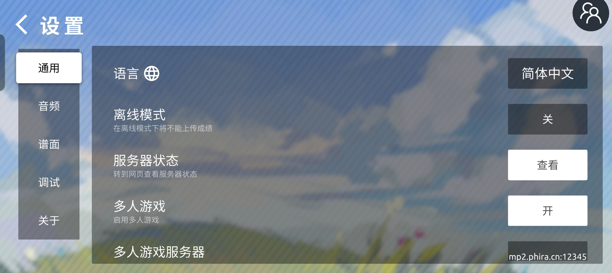

部分华为机型默认英文，进设置 → 通用 → 第一行，改成中文。

### 2. 音符调节（Offset）

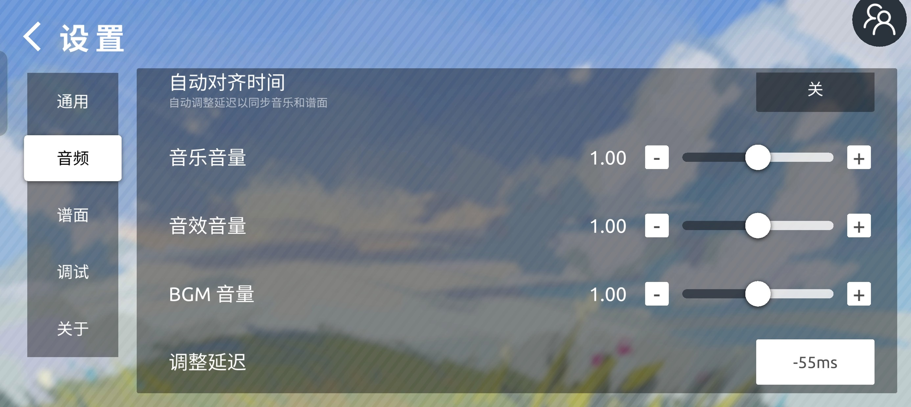

**最重要的设置，没有之一。**

如果感觉音符落到判定线的时候音乐对不上，就是延迟没调好。

- 正值：音符提前出现（音乐慢于画面）
- 负值：音符延后出现（音乐快于画面）
- 建议范围：**-100ms ~ +100ms**

**怎么调准**：
1. 找一首你熟悉的歌，闭眼听节奏，凭感觉打
2. 如果总是「提前点」或「滞后点」，就调 Offset
3. 调到「闭着眼睛也能 Perfect」为止

> 不同设备延迟不一样，换手机/耳机/蓝牙音箱都要重新调。
> 
> ### 4. 调试功能（高阶玩家）
> 
> 设置 → 调试页，有两个实用功能：
> 
> 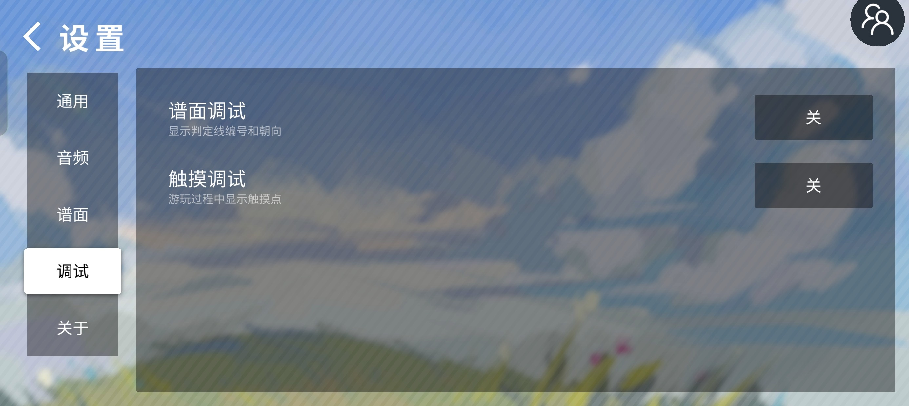
> 
> - **谱面调试**：显示判定线编号和朝向，方便研究谱面结构
> - **触摸调试**：游玩时显示触摸点，排查触控问题

### 3. 画质调整

- 低画质：流畅，但特效少
- 高画质：好看，但可能卡顿
- 建议：手机配置一般的开中画质，配置好的开高画质

### 4. 多人游戏模式

设置里可以开多人模式，跟朋友一起打同一首谱面。

- 需要联网
- 延迟大的话体验很差
- 建议跟同地区的朋友玩

---

## 八、进阶技巧：从「能玩」到「会玩」

### 1. 读谱能力

- 不要只盯着判定线，要**提前看上方**的音符排列
- 遇到复杂段落，先判断「哪只手打哪边」，再动手
- 多打不同风格的谱面，提升综合读谱力

### 2. 设备优化

- **关闭后台程序**，降低延迟
- **开启「高精度触控」**（部分手机支持）
- 曲面屏手机调整判定线偏移，避免边缘误触
- 外接蓝牙耳机选**低延迟模式**，或者干脆用有线耳机

### 3. 多指协同

- 单指打简单谱，双指打中等谱，**四指/六指**打高难度谱
- 练习时先从双押（两只手同时点）开始
- 不要强求多指，先把双指练稳

### 4. 预判滑动

- 红色滑动键出现前，**提前预判轨迹**
- 手指放在滑动起点附近，减少移动距离
- 长滑动键可以「分段滑」，不用一次滑到底

---

## 九、更多常见问题（FAQ）

**Q：为什么点进「上架/未上架/热门」后曲绘全黑，也无法下载谱面？**
> 大概率是**服务器欠费**了，或者正在遭受 DDoS 攻击。排行榜和账号功能一般还能用，但下载功能会挂。等官方修吧，急也没用。
> 
> 下载失败时可能会弹出这样的错误：
> 
> 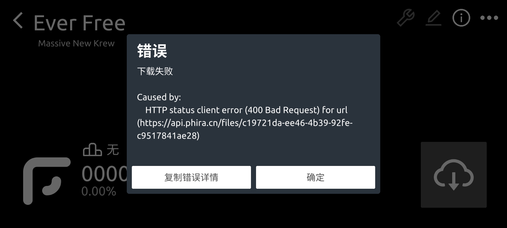

**Q：为什么谱面商店没有 Arcaea / 雷亚游戏 / Phigros 的独占曲目？**
> **版权问题**。这些游戏的独占曲目在 Phira 里会被下架，上传也大概率不受理。想玩去正版游戏里玩。

**Q：为什么我只能上传 3 张谱面？**
> Phira 对每个用户的上传数量有限制，初始只能传 3 张。上传后是 **unstable** 状态，可以随时修改。修改谱面文件会**清除排行榜**。等谱面质量稳定后，可以申请标记为 **stable**，stable 后不再占用上传限额，但内容不能再改。

**Q：为什么我导入的资源包没有效果或显示错误？**
> 可能是资源包跟当前游戏版本不兼容，或者文件损坏。确认资源包来源的适用版本，重新下载试试。
> 
> 如果看到这种错误弹窗，说明 ZIP 文件本身有问题，换个资源包再试：
> 
> 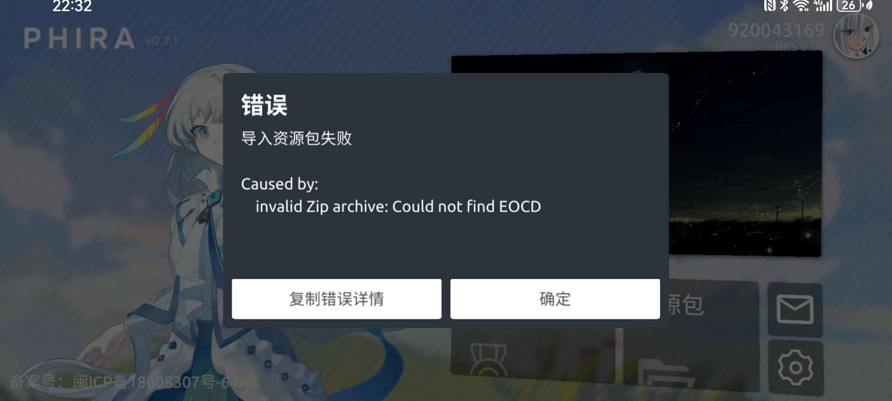

**Q：iOS 用户真的不能用资源包吗？**
> **真的不能**。用 ipa 文件安装的 Phira 无法使用资源包功能，这是系统限制，不是 Phira 故意恶心你。想换皮肤只能用安卓设备，或者等官方更新（遥遥无期）。

**Q：Phira 和 Phigros 有什么区别？**
> Phigros 是官方商业游戏，Phira 是**非商业社区音游**。Phira 的谱面全是玩家自制，质量参差不齐；Phigros 的谱面是官方制作，质量稳定。Phira 可以玩到你喜欢的任何歌的自制谱，Phigros 只能玩官方收录的曲目。

---

## 十、结语

写这篇的时候，我想起群里有人问：「为什么我打了 20 遍还是打不过？」

我说：「因为你打了 20 遍，不是练了 20 遍。」

**无脑重复打不过的段落，不如进练习模式慢速拆招。**

Phira 的魅力在于**无限可能的自制谱**——你今天被一首粪谱气到卸载，明天可能就遇到一首让你直呼「神作」的谱面。

> 最后送大家一句话：
> 
> **「没有打不过的谱，只有不够快的脑子和不够稳的手。」**

祝各位早日 AP，打不到 AP 就 FC，FC 不了就……换个简单点的谱吧，别跟自己过不去。

---

> 📸 **配图需求清单**（作者正在收集中，以下截图欢迎投稿）：
> 
> 1. `phira-adv-tap.png` —— 游戏内一个蓝键（Tap）落到判定线的截图
> 2. `phira-adv-hold.png` —— 游戏内一个黄键（Hold）被按住的截图
> 3. `phira-adv-drag.png` —— 游戏内红/粉色 Drag 音符的截图
> 4. `phira-adv-flick.png` —— 游戏内带箭头的 Flick 音符截图
> 5. `phira-adv-mods.png` —— 选谱界面右上角扳手图标点进去的模组设置页
> 6. `phira-adv-practice.png` —— 选谱界面的「练习」按钮及段落标记界面
> 7. `phira-adv-library.png` —— 主界面「游玩」进去的曲库分类页（本地/上架/未上架）
> 8. `phira-adv-settings.png` —— 主界面齿轮图标点进去的设置页
> 9. `phira-adv-offset.png` —— 设置里的「音符调节/Offset」选项截图
> 
> 截完发我，我帮你插进去！

*P.S. 本文基于 Phira v0.8.1 整理，如果后续版本有变动，大体逻辑应该差不多。*

*P.P.S. 如果这篇对你有帮助，欢迎转发给那个还在问「蓝键怎么点」的萌新。*
