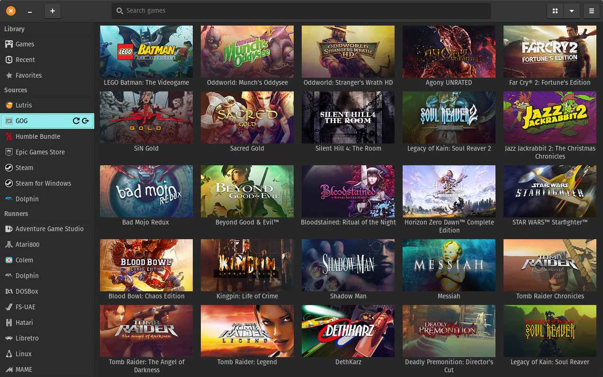
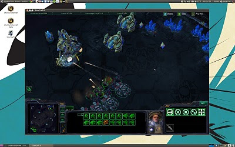
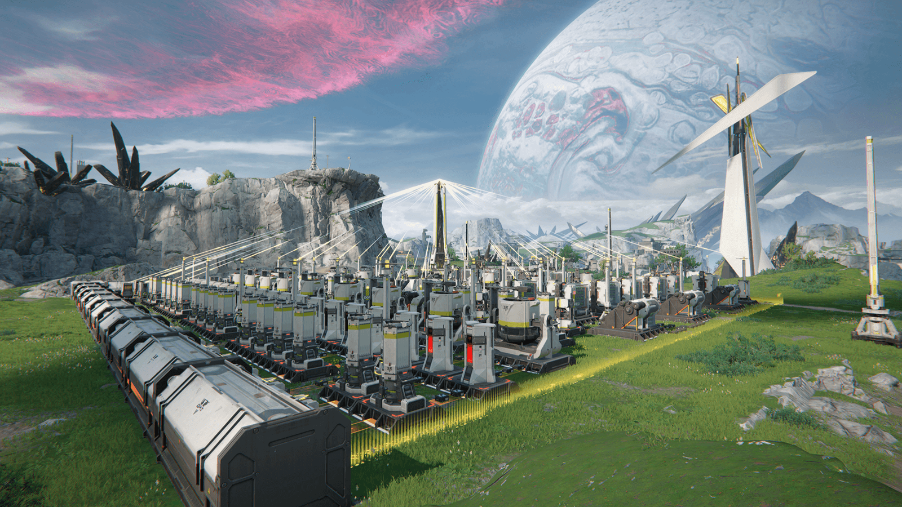
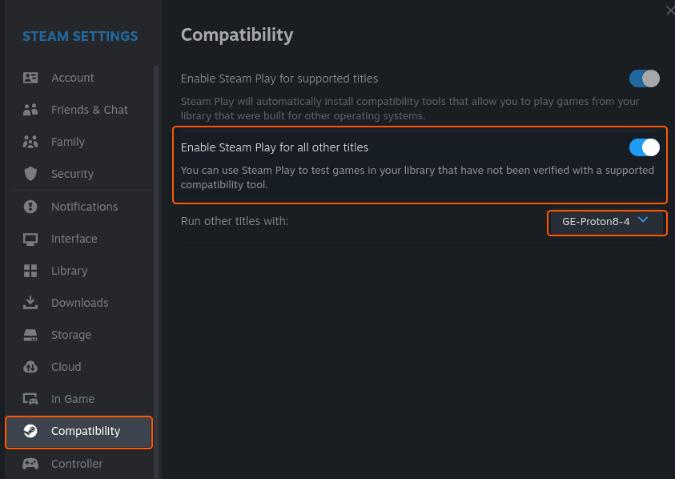

> 本文最后更新于 2026-08-02，基于 Wine 9.x、Lutris 0.5.22 及最新 Proton GE 整理。  
> 如果你跟着步骤走还是闪退，欢迎截图甩我，随叫随到 ( •̀ ω •́ )✧

<!-- more -->

## 零、先回答灵魂拷问：Linux 能玩游戏吗？

**能，而且玩得挺爽。**

以前说 Linux 玩游戏等于找罪受，那是 Wine 2.x 时代的事了。现在 Wine 9.x + DXVK + Proton GE 一套组合拳下来，Windows 游戏在 Linux 上跑起来帧数有时候甚至比 Win 还高——没错，说的就是某些二游。


本文给你两条路：
- **懒人路线**：Lutris 一键脚本，点点鼠标就完事
- **折腾路线**：纯 Wine/Proton 手动配置，自由度拉满

任君挑选，开整！

---

## 一、Wine 安装：各发行版一键命令

Wine 是核心翻译官，没有它 Windows 游戏在 Linux 上就是天书。不同发行版安装方式略有不同，对号入座就行。

### 1. Arch Linux / Manjaro

Arch 用户最简单，官方仓库直接有：

```bash
sudo pacman -S wine wine-mono wine-gecko winetricks
# 32位支持（很多老游戏需要）
sudo pacman -S lib32-libgl lib32-mesa lib32-vulkan-icd-loader
```

> 💡 **提示**：如果你用的是我 fork 的 Jakoolit 脚本，Wine 大概率已经装好了，跳过这步。

### 2. Ubuntu / Debian / Deepin

Debian 系稍微麻烦点，要加 WineHQ 官方源：

```bash
# 启用 32 位架构
sudo dpkg --add-architecture i386

# 下载并添加仓库密钥
sudo mkdir -pm755 /etc/apt/keyrings
sudo wget -O /etc/apt/keyrings/winehq-archive.key https://dl.winehq.org/wine-builds/winehq.key

# 添加仓库（以 Ubuntu 24.04 为例）
sudo wget -NP /etc/apt/sources.list.d/ https://dl.winehq.org/wine-builds/ubuntu/dists/noble/winehq-noble.sources

# 安装稳定版
sudo apt update
sudo apt install --install-recommends winehq-stable winetricks
```

Deepin 基于 Debian，上面的命令直接能用。如果源有问题，换国内镜像：

```bash
# 清华镜像（Deepin/Ubuntu 通用）
sudo sed -i 's|dl.winehq.org|mirrors.tuna.tsinghua.edu.cn/wine-builds|g' /etc/apt/sources.list.d/*.sources
sudo apt update
```

### 3. Fedora

```bash
sudo dnf install wine winetricks
# 32位 Vulkan 驱动（很多游戏刚需）
sudo dnf install mesa-vulkan-drivers.i686
```

### 4. 验证安装

装完敲这个，看到版本号就是成功了：

```bash
wine --version
# 输出类似：wine-9.0
```

---

## 二、Wine 环境配置：打好地基

Wine 装完只是开始，游戏能不能跑还得看 "前缀（Prefix）" 配置。简单说就是给每个游戏建一个独立的虚拟 C 盘，互不干扰。

### 1. 初始化前缀

```bash
# 创建一个专门的游戏前缀
export WINEPREFIX="$HOME/.wine-gaming"
winecfg
```

弹出的窗口里把 Windows 版本改成 **Windows 10**，点确定。

### 2. Winetricks 装运行库

游戏跑不起来 90% 是因为缺运行库。Winetricks 就是一键补库工具：

```bash
winetricks corefonts vcrun2019 vcrun2022 dotnet48 dxvk
```

常用库说明：

| 库名 | 作用 |
|------|------|
| `corefonts` | 基础字体，解决乱码 |
| `vcrun2019/2022` | Visual C++ 运行库，游戏刚需 |
| `dotnet48` | .NET Framework，部分启动器需要 |
| `dxvk` | DirectX 转 Vulkan，性能翻倍 |
| `allcodecs` | 音视频解码 |

### 3. DXVK / VKD3D-Proton

DXVK 把 DirectX 9/10/11 翻译成 Vulkan，帧数提升肉眼可见。

Arch 用户直接装：

```bash
sudo pacman -S dxvk-bin vkd3d-proton
```

其他发行版去 GitHub Release 下载手动放：

```bash
# 下载最新 DXVK
wget https://github.com/doitsujin/dxvk/releases/download/v2.4/dxvk-2.4.tar.gz
tar -xzf dxvk-2.4.tar.gz
cd dxvk-2.4
# 安装到当前前缀
./setup_dxvk.sh install
```

### 4. 游戏模式 GameMode

Feral Interactive 出的性能优化工具，自动调节 CPU 频率和进程优先级：

```bash
# Arch
sudo pacman -S gamemode lib32-gamemode

# Ubuntu/Debian
sudo apt install gamemode

# 启动游戏时加上
gamemoderun wine 你的游戏.exe
```

---

## 三、具体游戏安装：两条路线任你选

下面每个游戏都给两条路：**Lutris 懒人版** 和 **Wine/其他折腾版**。想省事的直接 Lutris，想折腾的往下看。



### 路线 A：Lutris 一键开玩（推荐）

Lutris 是个开源游戏平台，把 Wine、Proton、模拟器全包在一起，还能自动下载社区脚本。安装：

```bash
# Arch
sudo pacman -S lutris

# Ubuntu/Debian（下载 .deb）
cd ~/Downloads
wget https://github.com/lutris/lutris/releases/download/v0.5.22/lutris_0.5.22_all.deb
sudo apt install ./lutris_0.5.22_all.deb

# Flatpak（通用）
flatpak install flathub net.lutris.Lutris
```

装完打开 Lutris，点左上角 **+** → **Search the Lutris website**，输入游戏名，找到社区脚本一键安装。

### 路线 B：纯 Wine / 官方脚本 / 其他工具

适合喜欢自己掌控每一步的硬核玩家，或者 Lutris 脚本失效时的备用方案。

---

### 🎮 星际争霸Ⅱ

| 项目 | 内容 |
|------|------|
| **Lutris** | 搜索 "StarCraft II"，选 Battle.net 版脚本 |
| **Wine** | 先装 Battle.net 客户端，再在里面下载 SC2 |
| **注意** | 战役模式完美运行，天梯匹配也没问题 |

**Wine 手动安装步骤：**

```bash
export WINEPREFIX="$HOME/.wine-sc2"
winecfg  # 设为 Windows 10
winetricks corefonts vcrun2022

# 下载 Battle.net 安装器
wine Battle.net-Setup.exe
# 登录后在客户端里找到星际2，正常下载即可
```

> ⚠️ **反作弊提示**：星际2用的是暴雪自家反作弊，Wine 兼容良好，放心玩。



---

### 🎮 原神 / 崩坏：星穹铁道

米哈游全家桶在 Linux 上跑得很稳，而且**帧数有时候比 Windows 还高**（玄学优化）。

| 项目 | 内容 |
|------|------|
| **Lutris** | 搜索 "Genshin Impact" 或 "Honkai Star Rail"，选官方脚本 |
| **Wine** | 需用 **dwproton** 或 **GE-Proton** 运行器，配合特定 DLL |
| **注意** | 原神有内核级反作弊，必须用 dwproton 或特定 Wine 版本 |

**Lutris 安装（推荐）：**

1. 打开 Lutris → 点 **+** → **Install a Windows game from an executable**
2. 去米哈游官网下载启动器（`GenshinImpact_install_xxx.exe`）
3. **Runner** 选 `wine`，**Wine version** 选 `dwproton-10.0-16` 或更高
4. 安装完成后在启动器里下载游戏本体

**关键配置（Lutris → 右键游戏 → Configure）：**

| 选项卡 | 设置项 | 推荐值 |
|--------|--------|--------|
| Runner options | Wine version | `dwproton-10.0-16` |
| Runner options | Enable DXVK | ✅ On |
| Runner options | Enable VKD3D | ✅ On |
| Runner options | Enable Fsync | ✅ On |
| System options | FPS counter (MangoHud) | 可选 |

> 💡 **Arch 用户专属**：用 `yay -S protonplus-bin` 装 ProtonPlus，在 Lutris 选项卡里一键下载 dwproton。

---

### 🎮 明日方舟（PC 模拟器端）

明日方舟本身没有原生 Linux 客户端，但 PC 端本质是安卓模拟器，我们有两种思路：

| 路线 | 方法 | 说明 |
|------|------|------|
| **Lutris** | 搜索 "Arknights"，选官方或社区脚本 | 直接跑 PC 启动器 |
| **Waydroid** | 安卓容器跑官服 APK | 更轻量，但需折腾 |
| **Wine** | 跑 MuMu/雷电模拟器 | 不推荐，模拟器套娃性能差 |

**Lutris 方案（最稳）：**

1. Lutris 里搜索 "Arknights"，选带官方启动器的脚本
2. 或者手动：+ → Install from executable → 选鹰角网络启动器
3. Wine version 建议用 `wine-ge-8-26` 或 `lutris-GE-Proton8-32`
4. 在启动器里下载明日方舟即可

> ⚠️ **注意**：明日方舟 PC 端启动器基于 Electron，如果白屏，在 Winetricks 里装 `dotnet48` 和 `corefonts`。

---

### 🎮 明日方舟：终末地

终末地是鹰角的新作，有 PC 原生客户端，Linux 上通过 Wine/Lutris 运行效果相当不错。



| 项目 | 内容 |
|------|------|
| **Lutris** | 搜索 "Arknights Endfield"，用社区脚本 |
| **Wine** | 手动配置需 dwproton + 特定 DLL Overrides |
| **注意** | 终末地有 ACE 反作弊，必须用 dwproton 或兼容运行器 |

**Lutris 详细步骤：**

1. 访问 [终末地官网](https://endfield.hypergryph.com/) 下载 PC 启动器
2. Lutris → + → **Install a Windows game from an executable**
3. Executable 选下载好的 `HypergryphLauncher_xxx_endfield.exe`
4. Wine prefix 选个专门文件夹，比如 `~/Games/Endfield`
5. **关键**：Runner Options → Wine version 手动选 `dwproton-10.0-16`
6. 确保 **Esync** 和 **Fsync** 都开启
7. 在启动器里登录并下载游戏本体

**如果启动器白屏/闪退，加这些 DLL Overrides：**

| Key | Value | 作用 |
|-----|-------|------|
| `winemenubuilder.exe` | `Disabled` | 防止生成垃圾快捷方式 |
| `mbedtls` | `native, builtin` | 解决启动器网络加密问题 |
| `d3dcompiler_47` | `native` | 解决 Unity 着色器编译错误 |

**性能监控：**

```bash
# Arch 装 MangoHud
yay -S mangohud lib32-mangohud

# 然后在 Lutris → System options → FPS counter 开启
# 或者用 goverlay 可视化调配置
yay -S goverlay
```

> 🔥 **实测**：Arch + dwproton + Fsync 开启后，终末地帧数在部分场景下比 Windows 还高，Linux 玄学优化实锤了。

---

### 🎮 网易游戏（永劫无间 / 逆水寒 / 蛋仔派对等）

网易系游戏比较杂，有的能跑有的不能，逐个说：

| 游戏 | Linux 支持 | 推荐方式 |
|------|-----------|----------|
| **永劫无间** | ❌ 难 | 有内核级反作弊，Wine 基本无解 |
| **逆水寒** | ⚠️ 可试 | Lutris 社区脚本，或用 Steam 版 |
| **蛋仔派对** | ✅ 可跑 | 安卓模拟器 / Waydroid |
| **第五人格** | ✅ 可跑 | Lutris + 网易 MuMu 模拟器 |
| **我的世界网易版** | ⚠️ 可试 | 建议直接玩 Java 版国际服 |

**通用建议**：网易游戏如果有 Steam 版本（比如部分游戏上 Steam 了），直接用 Steam Proton 跑，成功率远高于纯 Wine。

---

## 四、Steam + Proton：最省心的方案

如果你游戏主要在 Steam 上买，那 Proton 是最省心的——Valve 官方维护，兼容层直接内嵌。



### 1. 启用 Steam Play

Steam → 设置 → Steam Play → 勾选：
- ✅ **Enable Steam Play for supported titles**
- ✅ **Enable Steam Play for all other titles**

### 2. 安装 Proton GE（性能更强）

Proton GE 是社区魔改版，兼容性和性能都比官方 Proton 好：

```bash
# Arch（AUR）
yay -S proton-ge-custom-bin

# 或者手动
mkdir -p ~/.steam/root/compatibilitytools.d
cd ~/.steam/root/compatibilitytools.d
wget https://github.com/GloriousEggroll/proton-ge-custom/releases/download/GE-Proton9-25/GE-Proton9-25.tar.gz
tar -xzf GE-Proton9-25.tar.gz
```

装完重启 Steam，在游戏属性 → 兼容性里选 **GE-Proton**。

### 3. Steam 游戏启动参数推荐

右键游戏 → 属性 → 启动选项：

```bash
gamemoderun %command%  # 开启游戏模式
```

或者配合 MangoHud 显示帧数：

```bash
mangohud gamemoderun %command%
```

---

## 五、性能优化：榨干你的显卡

### 1. 游戏模式 GameMode

前面装过了，启动游戏时加上 `gamemoderun`：

```bash
gamemoderun wine 游戏.exe
# 或
gamemoderun %command%  # Steam 启动参数
```

### 2. DXVK 异步编译

减少着色器编译卡顿：

```bash
export DXVK_ASYNC=1
```

加到启动脚本里，或者 Lutris → System options → Environment variables 里添加。

### 3. CPU 性能模式

```bash
# 临时切换性能模式（需装 cpupower）
sudo cpupower frequency-set -g performance

# 或者装 auto-cpufreq
yay -S auto-cpufreq
sudo systemctl enable --now auto-cpufreq
```

### 4. GPU 性能模式

**NVIDIA：**

```bash
# 切换到最高性能模式
sudo nvidia-settings -a '[gpu:0]/GPUPowerMizerMode=1'
```

**AMD：**

```bash
echo 'high' | sudo tee /sys/class/drm/card0/device/power_dpm_force_performance_level
```

---

## 六、常见问题排查

| 症状 | 可能原因 | 解决方案 |
|------|---------|---------|
| 游戏闪退/打不开 | 缺 32 位 Vulkan 库 | 装 `lib32-vulkan-icd-loader` |
| 黑屏但有声音 | DXVK 初始化失败 | 更新显卡驱动，确认支持 Vulkan 1.3 |
| 中文乱码 | 缺中文字体 | Winetricks 装 `cjkfonts` 或手动放字体 |
| 帧数低/卡顿 | 没开 DXVK / Fsync | 检查 Lutris/Proton 配置 |
| 启动器白屏 | 缺 .NET / WebView | Winetricks 装 `dotnet48` |
| 反作弊报错 | 内核级反作弊（Vanguard等） | **无解**，换双系统或云游戏 |
| 手柄不识别 | 蓝牙连接顺序问题 | 先连手柄，再开游戏 |
| 音频爆音/缺失 | Wine 音频驱动问题 | Winetricks → 改音频为 ALSA 或 Pulse |

### 反作弊黑名单（Wine 目前无解）

以下游戏因为内核级反作弊，Wine/Proton 直接躺平：

- ❌ 无畏契约（Vanguard）
- ❌ 永劫无间（部分反作弊组件）
- ❌ PUBG（BattlEye 部分模式）
- ❌ APEX 英雄（Easy Anti-Cheat 部分模式）

> 但注意：很多游戏的反作弊已经支持 Proton 了（比如 EAC、BattlEye 的 Steam 版），具体看游戏官方公告。

---

## 七、推荐工具清单

| 工具 | 作用 | 安装 |
|------|------|------|
| **Lutris** | 游戏平台，一键脚本 | `sudo pacman -S lutris` |
| **Heroic Games Launcher** | Epic/GOG 游戏启动器 | `yay -S heroic-games-launcher-bin` |
| **MangoHud** | 游戏内性能监控 | `sudo pacman -S mangohud` |
| **Gamescope** | 微合成器，解决全屏问题 | `sudo pacman -S gamescope` |
| **ProtonPlus** | 管理 Proton/GE 版本 | `yay -S protonplus-bin` |
| **GOverlay** | MangoHud 可视化配置 | `yay -S goverlay` |
| **Bottles** | 现代化 Wine 前缀管理 | `flatpak install com.usebottles.bottles` |

### Gamescope 用法（解决全屏闪烁）

```bash
gamescope -W 1920 -H 1080 -r 144 -- wine 游戏.exe
# Steam 启动参数
gamescope -W 1920 -H 1080 -r 144 -- %command%
```

---

## 八、总结：一条命令检查清单

装游戏前跑一遍这个 checklist：

```bash
# 1. Wine 版本
wine --version

# 2. Vulkan 支持
vulkaninfo | grep "Vulkan Instance"

# 3. 32位 Vulkan
ls /usr/share/vulkan/icd.d/

# 4. DXVK 状态（在 Wine 前缀里）
ls $WINEPREFIX/drive_c/windows/system32/d3d11.dll

# 5. 游戏模式
gamemoded -t
```

全绿？那基本啥游戏都能跑了。

---

## 参考与致谢

- [WineHQ 官方文档](https://wiki.winehq.org/)
- [Lutris 官方下载页](https://lutris.net/downloads)
- [Proton GE GitHub](https://github.com/GloriousEggroll/proton-ge-custom)
- [DXVK GitHub](https://github.com/doitsujin/dxvk)
- [终末地 Arch 运行教程 - 0xav10086](https://www.0xav10086.space/posts/how-to-play-endfield-in-arch/)
- [Lutris 2026 完整设置指南 - shattered.io](https://shattered.io/lutris-setup-guide/)

---

> **免责声明**：本文仅供技术交流学习，游戏版权归各厂商所有。请支持正版，拒绝盗版。  
> 如果文章帮到你，欢迎去我博客点个 star ⭐
