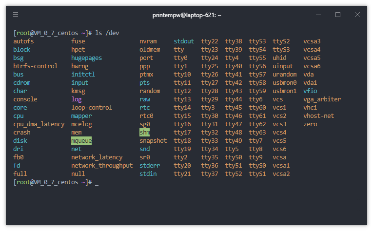

别被网上那些手动分区、手动挂载、手动配网络的教程吓退。Arch 官方早就给你准备了一个 **archinstall** 脚本，全程交互式，跟装 Windows 似的，下一步下一步就完事儿。

<!-- more -->

## (｀・ω・´) 准备工作

- 电脑一台，笔记本台式都行
- 没电脑的一边看乐呵去
- 一个 8G 以上的 U 盘（装系统用的，别拿你存学习资料的盘）
- 能上网的环境（没网装个锤子）
- 脑子（建议带上，虽然官方脚本已经帮你把脑子省了）



## (｡･ω･｡) 第一步：下载 Arch ISO

去官网下镜像，认准这个地址：

```
https://archlinux.org/download/
```

找个离你近的镜像站，下 `archlinux-xxxx.xx.xx-x86_64.iso`，大概 800MB 左右。

下完用 **Ventoy** 或者 **Rufus** 写进 U 盘，插电脑上开机。

> [!TIP]
> Ventoy 比 Rufus 好用一万倍，一次写入，以后换 ISO 直接复制进去就行，不用重新刷 U 盘。

## (ﾉ◕ヮ◕)ﾉ 第二步：进 Live 环境

U 盘启动，选第一个 `Arch Linux install medium (x86_64, UEFI)`，回车。

等一会儿，你会看到一个黑乎乎的终端，前面写着：

```
root@archiso ~ #
```

别慌，这就是 Arch 的 Live 环境，系统还没装，这是临时系统。

## (｡･ω･｡) 第三步：连网（重要！）

archinstall 脚本要联网下载包，没网直接寄。

### 有线网（插网线）：

```bash
dhcpcd    # 自动获取 IP，完事儿
```

### WiFi：

```bash
iwctl
# 进入 iwctl 后：
device list                    # 看你的无线网卡叫啥，比如 wlan0
station wlan0 scan              # 扫描 WiFi
station wlan0 get-networks     # 列出 WiFi 列表
station wlan0 connect "你的WiFi名"  # 连接，输密码
exit                           # 退出 iwctl
```

测试一下：

```bash
ping archlinux.org -c 3
```

看到 `64 bytes from ...` 就是通了。

> [!WARNING]
> 没网别往下走，archinstall 会报错。校园网/认证网可能比较麻烦，建议先插网线或者手机 USB 共享网络。

## ヾ(≧▽≦*)o 第四步：运行 archinstall 脚本（核心）

输入下面这行，见证奇迹：

```bash
archinstall
```

然后就是一个交互式菜单，跟着我一项一项选：

### 1. 语言 (Locale)

选 `zh_CN`（中文），或者你习惯英文就选 `en_US`。

### 2. 镜像地区 (Mirror region)

选 `China`，自动用国内源，下载飞快。

### 3. 磁盘布局 (Disk configuration)

选 `Best-effort default partition layout`（最佳 effort 默认分区）。

然后选你要装的硬盘（**千万别选 U 盘！**看容量区分）。

文件系统选 `ext4` 就行，Btrfs 新手别碰。

> [!CAUTION]
> 选硬盘的时候瞪大眼睛，选错了把你数据盘格了，神仙也救不回来。不确定就 `lsblk` 先看一眼。

### 4. 引导加载器 (Bootloader)

选 `systemd-boot`（UEFI 推荐）或者 `GRUB`（兼容性好）。

如果你不知道啥是 UEFI，选 GRUB 最保险。

### 5. 交换分区 (Swap)

内存 ≤ 8G 的建议选 `yes`，自动创建一个 Swap。

内存 16G 以上的可以选 `no`。

### 6. 主机名 (Hostname)

随便起，比如 `cxl-arch`、`my-pc`、`xia-pc`（别用中文，会寄）。

### 7. Root 密码

设一个你记得住的，别整太复杂，回头忘了还得重置。

### 8. 用户账户 (User account)

选 `Add a user`，用户名随便，比如 `xia`。

密码设好，然后一定要给它加 `sudo` 权限！

### 9. 配置文件 (Profile)

这是选桌面环境的！

- 想装图形界面？选 `Desktop` → 然后选 `gnome` / `kde` / `xfce` 等
- 想装 Hyprland？选 `Minimal` 或者 `Desktop` 里看有没有，装完再手动配
- 只要命令行？选 `Minimal`

### 10. 音频 (Audio)

选 `pipewire`，现在主流都用这个。

### 11. 内核 (Kernel)

默认 `linux` 就行，别折腾。

### 12. 额外包 (Additional packages)

可以顺手装几个常用的：

```
vim,nano,git,curl,wget,firefox
```

用英文逗号隔开，别加空格。

### 13. 网络配置 (Network configuration)

选 `NetworkManager`，装完桌面能直接连 WiFi。

### 14. 时区 (Timezone)

选 `Asia/Shanghai`。

## (｀・ω・´)b 第五步：确认安装

全部选完后，脚本会让你 review 一遍配置。看没问题就选 `Install`。

然后就去泡杯茶，等 5~20 分钟（看网速）。

看到 `Installation completed without any errors!` 就是成了！

## (｡･ω･｡)ﾉ 第六步：重启进系统

```bash
reboot
```

记得拔掉 U 盘！

## (ﾉ◕ヮ◕)ﾉ*:･ﾟ✧ 装完干啥？

如果你选了桌面环境，进去就是图形界面了。

如果选的 Minimal，进来是黑终端，接下来：

```bash
sudo pacman -Syu              # 更新系统
sudo pacman -S yay            # 装 AUR 助手（虽然 Minimal 里可能没配 AUR）
sudo pacman -S neofetch       # 装完必须跑一下，仪式感
neofetch                      # 截图发朋友圈
```

## (´･ω･`) 免责声明 & 售后服务

本教程基于 Arch 官方 `archinstall` 脚本，步骤已经尽量简化了。

但如果你：

- 看不懂英文菜单
- 不知道哪个是自己的硬盘
- 装完进不去系统
- 或者单纯就是懒

> [!CAUTION]
> **你要是看不懂，自个翻译拍照去，实在不行你给我 10 块钱儿，我给你包一个月，有啥问题随叫随到。**

---

祝你安装顺利，少报错，多折腾。

PS：Arch 没炸过几次的人生是不完整的。
