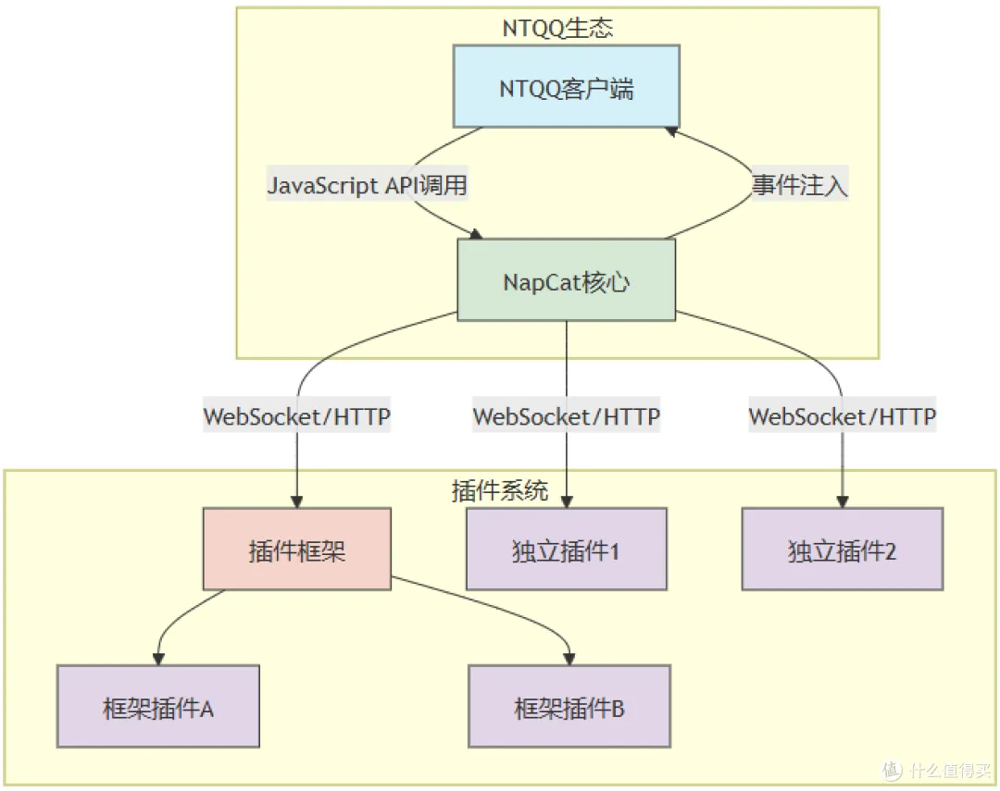

想让你的 QQ 号变成 24 小时在线的赛博打工仔？来，整一个机器人。本教程用 **NapCat**（QQ 协议端，基于 NTQQ）+ **AstrBot**（机器人框架），不用写代码，复制粘贴就能跑。

<!-- more -->

## (｡･ω･｡) 你需要准备啥

- 一台 Linux 服务器 / VPS / 本地电脑（Ubuntu/Debian/Arch 都行）
- 一个能登录的 QQ 小号（**别用大号**，万一风控了哭都没地儿哭）
- Docker 和 Docker Compose（不会装？往下看）
- 脑子（可选但建议带上）



## (｡･ω･｡) 第一步：安装 Docker

如果你服务器上已经有 Docker 了，直接跳到第二步。

```bash
# 一键安装 Docker（官方脚本，放心跑）
curl -fsSL https://get.docker.com | bash

# 启动 Docker 并设为开机自启
sudo systemctl enable --now docker

# 顺手把 docker-compose 也装上
sudo apt install docker-compose -y  # Debian/Ubuntu
# 或者
sudo pacman -S docker-compose       # Arch 用户狂喜
```

> [!TIP]
> 如果你连 Docker 都装不上，建议先回去补补 Linux 基础，或者……直接找铁子。

## (=^･ω･^=) 第二步：部署 NapCat（QQ 协议端）

NapCat 相当于一个无头 QQ，在后台帮你收发消息。

```bash
# 创建目录
mkdir -p ~/napcat && cd ~/napcat

# 用 Docker 跑 NapCat
docker run -d \
  --name napcat \
  --restart=always \
  -p 3000:3000 \
  -p 3001:3001 \
  -v $(pwd)/config:/app/config \
  mlikiway/napcat:latest

# 查看日志，等二维码
docker logs -f napcat
```

看到二维码链接后，复制到浏览器打开，用你准备的 **QQ 小号** 扫码登录。登录成功后按 `Ctrl+C` 退出日志查看。

> [!WARNING]
> 扫码登录的时候别手抖，扫错了号就尴尬了。建议提前把 QQ 小号登录到手机 QQ 上养几天号，降低风控概率。

## (｀・ω・´) 第三步：配置 NapCat 的 WebSocket

进 NapCat 的配置目录改一下：

```bash
cd ~/napcat/config
ls
```

找到类似 `onebot11_xxx.json` 的文件，编辑它：

```json
{
  "http": {
    "enable": false
  },
  "ws": {
    "enable": false
  },
  "reverse_ws": {
    "enable": true,
    "url": "ws://astrbot:6199/ws"
  }
}
```

> [!IMPORTANT]
> `ws://astrbot:6199/ws` 是 AstrBot 的默认反向 WebSocket 地址。如果 AstrBot 和 NapCat 在同一台机器的 Docker 里跑，用容器名 `astrbot` 通信；如果分开跑，改成实际 IP。

改完重启 NapCat：

```bash
docker restart napcat
```

## ヾ(≧▽≦*)o 第四步：部署 AstrBot（机器人大脑）

```bash
# 创建目录
mkdir -p ~/astrbot && cd ~/astrbot

# 写 docker-compose.yml
cat > docker-compose.yml << 'EOF'
version: '3'
services:
  astrbot:
    image: soulter/astrbot:latest
    container_name: astrbot
    restart: always
    ports:
      - "6199:6199"
      - "6185:6185"
    volumes:
      - ./data:/app/data
EOF

# 启动！
docker-compose up -d

# 看日志
docker logs -f astrbot
```

等看到 `AstrBot 启动成功` 类似的字样，就可以按 `Ctrl+C` 了。

## (｀・ω・´) 第五步：配置 AstrBot 连上 NapCat

1. 打开浏览器，访问 `http://你的服务器IP:6185`
2. 第一次进要设管理员密码，设完登录
3. 左侧菜单找 **消息平台适配器** → 添加 **OneBot V11**
4. 协议选 **反向 WebSocket**
5. 地址填 `ws://napcat:3001`（如果是同一台机器用 Docker 内网通信）
6. 保存，重启 AstrBot

> [!NOTE]
> 如果 AstrBot 和 NapCat 不在同一台机器，地址要填 NapCat 所在机器的实际 IP，比如 `ws://192.168.1.100:3001`。

## (ﾉ◕ヮ◕)ﾉ*:･ﾟ✧ 第六步：测试你的机器人

用你的主号给机器人 QQ 发一条消息：

```
/help
```

如果它回你了，恭喜你，赛博打工仔上线成功！(ﾉ◕ヮ◕)ﾉ*:･ﾟ✧

## (｀・ω・´) 常见问题（FAQ）

### Q: NapCat 登录不上，提示风控？

A: 正常，QQ 的风控很玄学。建议：

1. 用手机 QQ 先登录一次那个号，挂几天养号
2. 尝试用 `napcat-cli` 的扫码方式，别用密码登录
3. 实在不行换号，别跟它死磕

### Q: AstrBot 提示连接不上 NapCat？

A: 检查反向 WS 地址对不对。如果都是 Docker 跑的，用容器名通信（`napcat` / `astrbot`），别写 `127.0.0.1`，那是容器内部地址，互相找不到的。

### Q: 我想加 AI 回复功能？

A: 进 AstrBot 后台，左侧找 **服务商**，填上你的 OpenAI / Claude / 智谱 / 通义千问 API Key，然后启用 LLM 对话。具体选哪个模型看你钱包厚度。

### Q: 后台运行怎么关？

```bash
docker stop astrbot napcat   # 暂停
docker start astrbot napcat  # 启动
docker rm -f astrbot napcat  # 彻底删除（配置还在 volumes 里）
```

---

部署完记得去群里炫耀一下，"看，我有机器人了"。

如果炸了，回来再看一遍，或者……找铁子。
